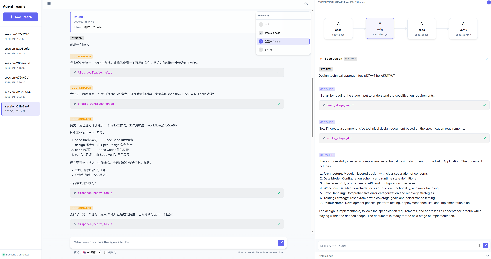

# relay-teams

Role-driven multi-agent orchestration framework built with strong typing and tool-only collaboration flow.
Runtime model execution uses `pydantic_ai` with OpenAI-compatible endpoints.

## Evaluation Snapshot

Recent SWE-bench snapshots are archived under [`docs/evaluations/swebench/`](docs/evaluations/swebench/README.md).
Current snapshots cover only the first `100` items from `SWE-bench Verified`, not the full benchmark.

Using glm-5,Temperature: 0.7,Top P:0.95.

| Mode | Benchmark | Pass Rate | Passed | Failed | Mean Duration | Input Tokens | Cached Input | Output Tokens | Requests | Tool Calls | Report |
| --- | --- | ---: | ---: | ---: | ---: | ---: | ---: | ---: | ---: | ---: | --- |
| Normal | SWE-bench Verified 100 | 72.0% | 72 | 28 | 369.2s | 60,265,198 | 58,214,976 | 451,537 | 2,432 | 2,484 | [HTML](docs/evaluations/swebench/normal-swebench-verified-100-report.html) |
| Orchestration | SWE-bench Verified 100 | 73.0% | 73 | 27 | 704.2s | 103,016,077 | 95,659,776 | 1,886,195 | 6,026 | 7,171 | [HTML](docs/evaluations/swebench/orchestration-swebench-verified-100-report.html) |

Highlights:

- `Orchestration` currently reaches `73/100` on `SWE-bench Verified 100`, with `96` runs finishing in `completed` state and `4` ending in `failed`.
- `Normal` mode currently reaches `72/100` on `SWE-bench Verified 100`, with `97` runs finishing in `completed` state and `3` ending in `failed`.
- Token usage is reported directly in the table so model IO and tool activity can be compared without deriving cost assumptions.

## Web Interface



Start the server with `uv run relay-teams server start` and open http://127.0.0.1:8000 in your browser.
Use `uv run relay-teams server restart` to restart the managed server, and `uv run relay-teams server stop --force` to force stop it.
The web UI now includes a language toggle beside the settings button so you can switch between English and Simplified Chinese in-page.

Frontend assets are now decoupled under `frontend/dist` and served by the backend.

### Temporary Public URL for GitHub Webhooks

The GitHub Webhook panel can create a temporary public URL for local testing.
This uses `localhost.run` over `ssh` and the service assigns a random temporary hostname such as `*.lhr.life`.
Users do not register the exact `lhr.life` hostname themselves.

How to use it:

1. Open `Automation -> GitHub -> GitHub Access`.
2. In `GitHub Webhook`, click `Create Temporary URL`.
3. Wait for the generated `Webhook Base URL` to be filled automatically.
4. Copy the derived `Callback URL` into GitHub's `Payload URL`.
5. Configure the same GitHub webhook `Secret` on both sides so GitHub sends `X-Hub-Signature-256`.

Notes:

- This feature requires `ssh` to be installed on the host running `relay-teams`.
- The temporary public hostname only stays valid while the tunnel is running.
- Use your own stable domain and reverse proxy for long-lived production webhooks.

## Quick start

### 1) Install dependencies

Use the setup script for your platform, install from PyPI, or install directly with `uv`.

Windows:

```powershell
.\setup.bat
```

Linux/macOS:

```bash
sh setup.sh
```

Install from PyPI:

```bash
pip install relay-teams
```

Direct install:

Windows:

```powershell
py -3 -m pip install uv
py -3 -m uv sync --extra dev
py -3 -m uv pip install -e .
```

Linux/macOS:

```bash
python3 -m pip install uv
python3 -m uv sync --extra dev
python3 -m uv pip install -e .
```

For local development, prefer `uv run --extra dev ...` over raw `python`, `pytest`, or `ruff` so commands execute inside the repository environment instead of a system interpreter.

### 2) help

```bash
relay-teams --help

# for evals
relay-teams-evals --help
```

If the `relay-teams` command is still missing in a fresh local checkout, the project package was not installed into the active virtual environment. Re-run the matching `-m uv pip install -e .` command above for your platform, or use `py -3 -m uv run python -m relay_teams --help` on Windows or `python3 -m uv run python -m relay_teams --help` on Linux/macOS as a fallback.

Examples:

```bash
uv run --extra dev pytest -q
uv run --extra dev ruff check --fix
uv run --extra dev basedpyright
```
