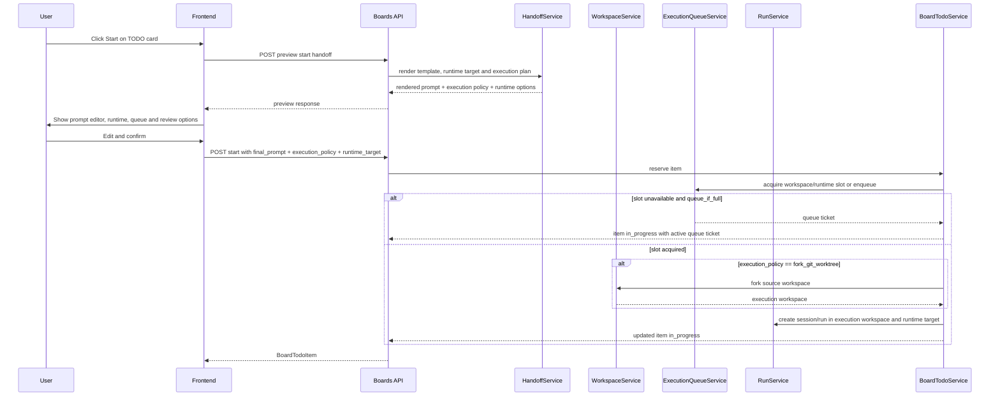
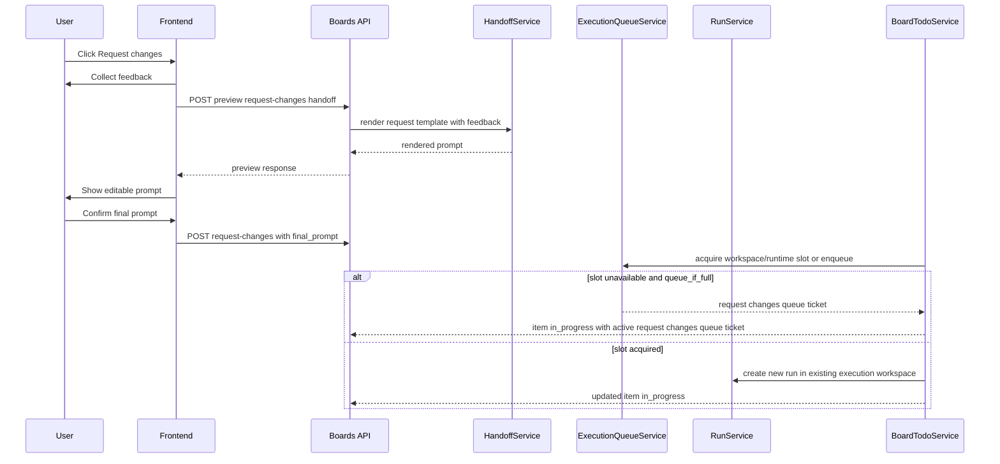

# Workspace TODO Board AGENTS Handoff Design

## 背景

当前 TODO Board 的 Start 行为自由度不足：

- 前端点击 Start 后直接调用 `startBoardTodo(todoId, {})`。
- 后端如果没有收到 `prompt`，使用 `_build_start_prompt(item)` 内置拼接。
- 用户看不到最终交给 AGENTS 的 prompt，也不能在启动前调整上下文、验收标准或执行方式。
- request changes 只收集 feedback，后端仍使用固定 `_build_request_changes_prompt()`。

目标设计是：用户必须能在交付前查看、编辑并确认最终 prompt；模板可以由用户配置，且不同 source 可以有不同模板。

## 设计原则

- 最终交给 AGENTS 的内容必须是用户确认过的 final prompt。
- 模板用于生成默认 prompt，不是不可见系统指令。
- 后端可以提供安全的 fallback 模板，但不应在 Start 时再次隐式拼接关键任务描述。
- Start 和 request changes 使用同一套 preview/edit/confirm 交互模型。
- 模板覆盖支持 source 粒度，便于 GitHub issue、manual TODO、Linear issue 使用不同上下文结构。
- Handoff 入口必须区分 `view_workspace_id` 与 `board_workspace_id`；fork workspace 页面上看到的是 root board 的 TODO，但 execution workspace 策略仍按每次 TODO handoff 独立决定。
- Handoff 必须同时声明 execution workspace 策略，默认用独立 Git worktree fork 隔离代码修改，避免多个 AGENTS run 共享同一个可写工作树。
- Handoff 必须同时声明 runtime target 和 review policy。TODO Board 只选择本地 role、外部 agent role 或 orchestration preset，不直接调用外部 agent runtime。
- AI 发放也必须经过同一套 preview/render/final prompt/start 语义；`ai_auto_start` 只是自动确认策略，不是绕过 handoff。

## 用户流程

### Start



### Request Changes



### AI 发放

AI 发放分两类：

| Mode | 行为 |
| --- | --- |
| `ai_suggested` | AI 生成建议 prompt、runtime target、execution policy、review policy，用户打开 Start editor 后确认或修改 |
| `ai_auto` | AI 根据策略自动提交 final prompt，但仍要通过 runtime target 校验、execution workspace 策略和并发限制 |

约束：

- AI 只能选择 source/workspace policy 允许的 runtime target。
- AI auto start 必须保存 `handoff_initiator = ai_auto`、`start_policy = ai_auto_start`、template source 和 final prompt metadata。
- AI auto start 默认 `queue_if_full = true`；并发满时进入 `in_progress` 并创建可审计 queue ticket。
- AI auto start 和人工 Start 一样必须保存完整 final prompt snapshot/ref；如果进入队列，后续 queue worker 只能使用该 snapshot 创建 run。
- AI 创建的新 TODO 是线性独立 TODO，必须携带 `idempotency_key`，不形成 parent/child dependency。
- preview/render 失败时 AI 不得直接启动，应记录 diagnostics 并保持 item 在 `todo`。

## Execution Workspace

Handoff 不只包含 `final_prompt`，还必须包含执行 workspace 策略。原因是 TODO Board 经常会同时启动多个代码修改任务，如果这些 run 都直接在同一个 workspace root 中修改文件，会造成工作树污染、diff 混杂、测试结果互相影响和 PR 归因困难。

### Execution Policy

首版支持两种策略：

| Policy | 含义 | 默认使用场景 |
| --- | --- | --- |
| `fork_git_worktree` | 先通过 workspace fork 创建独立 Git worktree，再在 fork workspace 中创建 session/run | 默认推荐，适合可能修改代码的 TODO |
| `current_workspace` | 直接在当前页面的 `view_workspace_id` 中创建 session/run；fork view 中即用户当前打开的 fork workspace，不回退到 TODO 所属 root workspace | 仅用于明确不修改代码的任务，或用户显式选择 |

默认策略：

- GitHub issue 和 manual TODO 只要可能涉及代码修改，preview 默认推荐 `fork_git_worktree`。
- source 可以通过 metadata 标记某类 TODO 不需要隔离，但 UI 仍应展示当前策略。
- 用户可以在 Start prompt editor 中切换策略；选择 `current_workspace` 时，UI 必须提示多个 AGENTS run 可能共享同一个可写工作树，并明确显示将使用当前 `view_workspace_id` 作为 execution workspace。

### Fork 行为

当用户确认 `fork_git_worktree`：

1. Board service 先 reserve item，防止重复启动。
2. Board service 调用 workspace 模块已有 `POST /api/workspaces/{workspace_id}:fork` 对应服务能力。
3. Workspace service 创建 `git_worktree` backend 的 fork workspace。
4. Board service 创建 session/run 时使用 fork 后的 `execution_workspace_id`。
5. Board item 仍显示在 `board_workspace_id` 对应的 TODO board 中，但详情记录 execution workspace。

Boards 模块不重新实现 Git worktree 操作。它只声明执行策略、调用 workspace 服务、保存引用和展示关系。

### Fork View 下的 Handoff

用户可能在 fork 出来的 `git_worktree` workspace 中打开 TODO 页面。此时页面展示的是 root workspace 的同一套 board，而不是 fork-local board。Start/Request Changes 必须遵循以下规则：

- Preview response 返回 `board_workspace_id`、`view_workspace_id`、`is_fork_view` 和 `forked_from_workspace_id`，并把 source/board context 与 execution context 分开展示。
- 对尚无 `execution_workspace_id` 的 TODO，即使用户当前在某个 fork workspace 页面点击 Start，默认仍从 root/source workspace 按 `fork_git_worktree` 创建新的 execution workspace，保持“一次 TODO handoff 一个隔离工作树”的并发安全策略。
- 如果当前 fork workspace 已经等于该 TODO 的 `execution_workspace_id`，Request Changes 默认复用当前 fork workspace。
- 如果用户显式选择 `current_workspace` 且当前 `view_workspace_id` 是 fork workspace，UI 必须警告该 fork 可能被多个 TODO/run 共享，默认不推荐。
- `view_workspace_id` 不写入 item 主行，只写入 attempt/event audit metadata，例如 `initiated_from_workspace_id`。

### Workspace 引用

Board item 目标设计增加执行引用：

| 字段 | 说明 |
| --- | --- |
| `board_workspace_id` | TODO board 的真正归属 workspace；fork view 解析到 root workspace |
| `source_workspace_id` | TODO 所属原 workspace；现有 `workspace_id` 语义应迁移或明确为 source workspace |
| `view_workspace_id` | 当前操作发生的 workspace；不写入 item 主行，可写入 attempt/event metadata |
| `execution_workspace_id` | AGENTS 实际执行的 workspace |
| `execution_branch_name` | fork branch，例如 `fork/{workspace_id}` |
| `execution_policy` | `fork_git_worktree` 或 `current_workspace` |
| `current_attempt_id` | 最近一次 start/request changes/review attempt |
| `active_attempt_id` | 当前 active attempt |
| `queue_ticket_id` | 并发满时的 queue ticket；等待事实不作为 board 状态 |
| `diagnostic_count` | 未清理 diagnostics 数量 |

Card detail 同时展示 source workspace 和 execution workspace：

- Board workspace 用于 board list、revision、source settings、template 和 sync。
- Source workspace 用于 source sync 和 card source scope。
- Current/view workspace 用于说明用户当前从哪个 workspace 操作。
- Execution workspace 用于 session/run、文件修改、diff、测试和后续 PR 准备。

### Request Changes 复用

`request changes` 默认复用该 TODO 已绑定的 execution workspace：

- 如果 item 已有 `execution_workspace_id`，新 run 继续绑定该 workspace。
- 默认复用原 executor runtime target；用户显式换 runtime target 时必须重新校验 allowed targets 和并发上限。
- 不默认重新 fork，避免 review 修改与前一次实现分裂到不同工作树。
- 如果未来支持“重新 fork 修改”，应作为显式高级操作，而不是首版默认。

Legacy 迁移：

- 旧实现创建的 `review` item 可能只有 `workspace_id/session_id/run_id`，没有 `execution_workspace_id`。
- 这类 item 首次 request changes 时只能从旧 session workspace 或旧 completed attempt workspace 推导 execution workspace；不能使用当前 fork view 的 `view_workspace_id`。无法证明原执行 workspace 时返回 conflict，避免已有 review item 被返工到无关 fork。
- 新目标数据必须在 Start/request changes 时写入明确的 execution workspace 引用。

### 生命周期

- Session 删除不删除 fork worktree。
- Archive/done 不自动删除 fork worktree。
- Fork workspace 生命周期归 workspace 模块管理，用户通过 workspace 删除流程清理。
- Board item 只保存 execution workspace 引用和状态 reason，不能私自移除 worktree。
- Workspace 删除事件必须进入 board lifecycle bridge：如果被删除的是 `execution_workspace_id`，item 保持当前 board status 但写 `execution_workspace_missing` diagnostic；`in_progress` 释放或等待 terminal 的 active slot 按 run/session 状态 reconcile，`review` 的 Request Changes/AI Review 在缺少 execution context 时返回 conflict。

## Runtime Target

Handoff preview 必须返回可选 runtime target，Start request 必须提交最终 runtime target。

| Runtime target kind | 含义 |
| --- | --- |
| `local_role` | 使用未绑定外部 agent 的 Agent Teams role |
| `external_role` | 使用绑定了 `bound_agent_id` 的 role，底层由 `agent_runtimes` 走 `acp`、`a2a` 或 `cli` |
| `orchestration_preset` | 使用 orchestration preset 创建 orchestration session/run |

Handoff 层只选择 target，不直接处理 external agent secret、transport 或 protocol。实际执行仍由 sessions/runs 和 agent runtime/provider 层负责。

模板变量补充：

| 变量 | 说明 |
| --- | --- |
| `runtime.target_id` | 选中的 runtime target |
| `runtime.target_kind` | `local_role`、`external_role`、`orchestration_preset` |
| `runtime.display_name` | 展示名 |
| `runtime.role_id` | role target 的 role id |
| `runtime.orchestration_preset_id` | orchestration target 的 preset id |
| `runtime.bound_agent_id` | external role 绑定的 agent id |
| `runtime.external_protocol` | `acp`、`a2a` 或 `cli` |
| `runtime.external_transport` | `stdio`、`streamable_http` 或 `custom` |

## Review Policy

Start 时可以同时选择 review policy：

| review_policy | 行为 |
| --- | --- |
| `human_required` | run completed 后进入 `review`，等待用户确认 |
| `ai_pre_review` | 进入 `review` 后先启动 AI review，AI 结论展示给用户，最终仍由人确认 |
| `ai_auto_done` | AI review 通过后可直接进入 `done` |

AI review 可以选择独立 reviewer runtime target。reviewer runtime target 与 executor runtime target 分开计入并发上限。

模板变量补充：

| 变量 | 说明 |
| --- | --- |
| `review.policy` | `human_required`、`ai_pre_review`、`ai_auto_done` |
| `review.runtime_target_id` | reviewer runtime target |
| `review.state` | AI review 的归一化状态，例如 waiting/running/approved/changes requested/needs human/failed |
| `review.decision` | AI review decision |

## 模板层级

模板优先级：

1. source template override。
2. workspace template override。
3. global default template。
4. built-in fallback template。

解释：

- source template 最贴近不同数据来源，例如 GitHub issue 要包含 repo/issue URL，manual TODO 可能只需要正文和验收标准。
- workspace template 适合团队统一格式。
- global default template 适合全局默认偏好。
- built-in fallback 只保证系统可用，不作为用户主要配置入口。

模板类型：

| Template kind | 用途 |
| --- | --- |
| `start` | 从 `todo` 启动处理 |
| `request_changes` | 从 `review` 请求修改 |
| `ai_review` | run completed 后由 reviewer runtime 进行 AI review |

未来可扩展：

- `review_summary`：生成验收摘要。
- `source_comment`：向外部 tracker 写评论。
- `done_note`：完成时生成交付说明。

## 模板变量

模板变量必须是显式、稳定、可预览的。变量缺失时应渲染为空字符串或明确 diagnostics，不能抛出导致 Start 不可用，除非 final prompt 为空。

通用变量：

| 变量 | 说明 |
| --- | --- |
| `todo.id` | Board TODO id |
| `todo.title` | 标题 |
| `todo.body` | 正文 |
| `todo.status` | 当前 board 状态 |
| `todo.status_reason` | 最近状态原因 |
| `workspace.id` | workspace id |
| `workspace.board_id` | TODO board 归属 workspace id |
| `workspace.view_id` | 用户当前打开或发起操作的 workspace id |
| `workspace.is_fork_view` | 当前 view workspace 是否为 fork workspace |
| `workspace.source_id` | TODO 所属原 workspace id |
| `workspace.execution_id` | AGENTS 实际执行 workspace id |
| `workspace.execution_root` | execution workspace root path 或 root reference |
| `workspace.execution_backend` | `project`、`git_worktree` 等执行后端 |
| `workspace.branch_name` | execution workspace 分支名 |
| `workspace.forked_from_workspace_id` | fork 来源 workspace id |
| `source.provider` | `local`、`github` 等 |
| `source.kind` | `manual`、`github_issues` 等 |
| `source.display_name` | source 名称 |
| `source.url` | 外部 source URL |
| `session.id` | 已绑定 session，可能为空 |
| `run.id` | 当前或上一次 run，可能为空 |
| `handoff.execution_policy` | `current_workspace` 或 `fork_git_worktree` |
| `handoff.requires_isolation` | 是否建议隔离执行 |
| `handoff.feedback` | request changes 用户反馈 |
| `handoff.initiator` | `human`、`ai_suggested`、`ai_auto` |
| `handoff.start_policy` | `human_required`、`ai_suggest_then_confirm`、`ai_auto_start` |
| `handoff.queue_if_full` | 并发满时是否进入 queued |
| `handoff.queue_ticket_id` | 当前 queue ticket，可能为空 |
| `attempt.previous_summaries` | 最近 attempt 摘要 |
| `attempt.previous_errors` | 最近失败原因 |
| `attempt.last_verification` | 最近验证结果 |
| `attempt.last_changed_files` | 最近一次 attempt 的 changed files 摘要 |
| `diagnostics.open_count` | 未清理 diagnostic 数量 |

GitHub 变量：

| 变量 | 说明 |
| --- | --- |
| `github.repository` | `owner/repo` |
| `github.issue_number` | issue number |
| `github.issue_url` | issue URL |
| `github.pull_request_number` | linked PR number |
| `github.pull_request_url` | linked PR URL |

系统变量：

| 变量 | 说明 |
| --- | --- |
| `now` | 渲染时间 |
| `template.source` | 当前命中的模板来源 |

## 默认 Start 模板

默认模板应清楚表达任务、来源和完成期望，但不规定过多实现策略。

示例：

```text
Please work on this Workspace TODO item.

Title: {{ todo.title }}
Source: {{ source.provider }}/{{ source.kind }}
Repository: {{ github.repository }}
Issue: #{{ github.issue_number }}
URL: {{ source.url }}

Execution workspace:
- Board workspace: {{ workspace.board_id }}
- Current view workspace: {{ workspace.view_id }}
- Fork view: {{ workspace.is_fork_view }}
- Source workspace: {{ workspace.source_id }}
- Execution workspace: {{ workspace.execution_id }}
- Execution backend: {{ workspace.execution_backend }}
- Branch: {{ workspace.branch_name }}
- Forked from: {{ workspace.forked_from_workspace_id }}
- Execution policy: {{ handoff.execution_policy }}

Runtime:
- Runtime target: {{ runtime.display_name }} ({{ runtime.target_kind }})
- Role: {{ runtime.role_id }}
- External agent: {{ runtime.bound_agent_id }}

Review:
- Review policy: {{ review.policy }}
- Reviewer runtime: {{ review.runtime_target_id }}

Work only in the execution workspace. If the execution policy is
fork_git_worktree, do not modify files in the source workspace directly.

Details:
{{ todo.body }}

When finished, summarize:
- Execution workspace and branch used
- changed_files
- verification
- created_todos, if you create follow-up TODOs. Each item must include an idempotency key and is a separate linear TODO, not a dependency.
- blocked_reason, only if you cannot continue
- retry_notes
- residual_risk
```

如果变量为空，渲染器应删除明显空行或保留为空值，具体实现可选择一种稳定策略，但 preview 和 final 渲染必须一致。

## 默认 Request Changes 模板

示例：

```text
Please revise the work for this Workspace TODO item.

Title: {{ todo.title }}
Board TODO ID: {{ todo.id }}
Original source: {{ source.url }}

Requested changes:
{{ handoff.feedback }}

Prior attempt context:
- Previous summaries: {{ attempt.previous_summaries }}
- Previous errors: {{ attempt.previous_errors }}
- Last verification: {{ attempt.last_verification }}
- Last changed files: {{ attempt.last_changed_files }}

Keep the final response focused on what changed and how it was verified.

Include structured completion metadata:
- changed_files
- verification
- blocked_reason, if any
- retry_notes
- residual_risk
```

## Structured Completion Metadata

Start、Request Changes 和 AI Review 模板都应要求 AGENTS 输出结构化完成信息。Board 不要求运行时强制输出 JSON，但 handoff 模板和 review UI 需要围绕这些字段设计：

| 字段 | 说明 |
| --- | --- |
| `changed_files` | 文件变更摘要 |
| `verification` | 测试、检查或未验证原因 |
| `created_todos` | AGENTS 创建的线性后续 TODO；不表达依赖关系 |
| `blocked_reason` | 本次 attempt 无法继续的原因；仅作为 attempt metadata 或 diagnostic |
| `retry_notes` | 后续 request changes 或 retry 应注意的内容 |
| `residual_risk` | 人工 review 重点和剩余风险 |

这些字段写入 `BoardTodoAttempt.metadata`，并在 card detail、AI review prompt 和 request-changes preview 中可见。

## Handoff Prompt Snapshot

Start、Request Changes、AI auto start 和 AI Review 在确认 final prompt 后必须保存完整 prompt snapshot/ref。这样即使 handoff 或 review 因并发上限进入 queue，还没有创建 run/message history，后续 queue worker 也能可靠使用同一个 final prompt 创建 run。

目标可以新增 `board_todo_handoff_prompts` 表，或使用等价存储。最小字段：

| 字段 | 说明 |
| --- | --- |
| `prompt_ref` | prompt snapshot id，供 attempt 和 queue ticket 引用 |
| `todo_id` | 关联 TODO |
| `attempt_id` | 关联 start、request changes 或 AI review attempt |
| `template_source` | source/workspace/global/fallback，或 AI suggested source |
| `final_prompt_snapshot` | 用户或 AI policy 最终确认的完整 prompt |
| `template_kind` | `start`、`request_changes` 或 `ai_review` |
| `created_at` | snapshot 创建时间 |

完整 prompt 创建 run 后仍会进入 session history。Board 侧 snapshot 是 queue 恢复、审计和失败诊断所需数据；摘要 metadata 不能替代执行用 prompt。

## TODO-bound Worker Context

TODO-bound session/run 可以获得最小 board context，帮助 AGENTS 理解当前 TODO 的历史和协作记录。该上下文不等于普通 session 的全局工具集。

Preview 和 Start 时应能向模板暴露：

- 当前 TODO 和 source 信息。
- source workspace 与 execution workspace。
- active queue ticket 或 runtime slot 决策。
- prior attempts 摘要、失败原因和 verification。
- comments 摘要。
- unresolved diagnostics。

后续实现可以提供最小 TODO-bound 工具集：

| tool | 语义 |
| --- | --- |
| `board_todo_show` | 读取当前 TODO、prior attempts、comments、events 和 diagnostics |
| `board_todo_comment` | 写入当前 TODO 的 comment thread |
| `board_todo_create` | 创建新的线性 TODO，必须带 idempotency key |
| `board_todo_report_progress` | 写入进度 comment 或 event |

工具边界：

- 只在 TODO-bound session/run 中暴露。
- 必须校验当前 session/run 绑定的 `todo_id`。
- 默认只能操作当前 TODO；`board_todo_create` 创建的新 TODO 不形成依赖关系。
- 不提供 worker 直接把 TODO 标为 `done` 的默认能力；完成仍由 run terminal、AI review、用户确认或 source evidence 驱动。

## API 方向

目标 API 仅作为设计方向，具体 schema 在实现阶段写入 core API 文档。

### Preview Start

```text
POST /api/boards/todos/{todo_id}:preview-start
```

Request：

```json
{
  "view_workspace_id": "workspace-current-view",
  "template_override": null,
  "execution_policy": null,
  "runtime_target_id": null,
  "review_policy": null,
  "review_runtime_target_id": null,
  "queue_if_full": true
}
```

Preview request 中的 `view_workspace_id` 表示用户当前打开 TODO 页面所在 workspace。runtime、review 和 queue 字段表示用户当前在 Start editor 中选择的候选值。后端必须基于这些候选值重新渲染 runtime options、review options、concurrency snapshot 和 queue preview，避免用户切换 runtime 后仍看到旧 slot 结果。fork view 下，preview 必须使用该 `view_workspace_id` 渲染 `workspace.view_id`、fork warning 和 `current_workspace` execution context，不能只从 `todo_id` 推导 root board workspace。

Response：

```json
{
  "todo_id": "btodo_123",
  "board_workspace_id": "root_workspace",
  "view_workspace_id": "fork_workspace",
  "is_fork_view": true,
  "forked_from_workspace_id": "root_workspace",
  "template_kind": "start",
  "template_source": "source",
  "prompt": "rendered prompt",
  "recommended_runtime_target": {
    "runtime_target_id": "role:main_agent",
    "runtime_target_kind": "local_role",
    "display_name": "Main Agent"
  },
  "runtime_options": [],
  "recommended_execution_policy": "fork_git_worktree",
  "execution_workspace_preview": {
    "source_workspace_id": "workspace",
    "execution_workspace_id": null,
    "execution_backend": "git_worktree",
    "branch_name": null
  },
  "fork_name_suggestion": "workspace-btodo-123",
  "workspace_variables": {
    "board_id": "root_workspace",
    "view_id": "fork_workspace",
    "is_fork_view": true,
    "source_id": "workspace",
    "execution_id": "",
    "execution_root": "",
    "execution_backend": "git_worktree",
    "branch_name": "",
    "forked_from_workspace_id": "workspace"
  },
  "review_policy": "human_required",
  "review_runtime_options": [],
  "concurrency_snapshot": {
    "source_workspace": {
      "limit": 2,
      "active": 1,
      "available": 1
    },
    "runtime_target": {
      "limit": 1,
      "active": 1,
      "available": 0
    }
  },
  "queue_preview": {
    "would_queue": true,
    "reason": "runtime target concurrency limit reached"
  },
  "attempt_context": {
    "previous_summaries": [],
    "previous_errors": []
  },
  "diagnostic_count": 0,
  "variables": {},
  "diagnostics": []
}
```

### Start With Final Prompt

```text
POST /api/boards/todos/{todo_id}:start
```

Request：

```json
{
  "final_prompt": "user confirmed prompt",
  "idempotency_key": "start-btodo-123-attempt-1",
  "view_workspace_id": "workspace-current-view",
  "execution_workspace_id": null,
  "execution_policy": "fork_git_worktree",
  "runtime_target_id": "role:main_agent",
  "queue_if_full": true,
  "start_policy": "human_required",
  "handoff_initiator": "human",
  "review_policy": "ai_pre_review",
  "review_runtime_target_id": "role:reviewer",
  "fork_name": "workspace-btodo-123",
  "start_ref": null,
  "yolo": true
}
```

Rules：

- `final_prompt` 必须非空。
- `idempotency_key` 用于去重 confirmed Start 请求；人工 Start、AI suggested 和 AI auto 都必须提交稳定 key，避免 timeout/retry 在 fork、session 或 run 已创建但响应未返回时产生重复执行。
- `runtime_target_id` 必须在 allowed runtime targets 中。
- `review_policy=ai_pre_review` 或 `ai_auto_done` 时，`review_runtime_target_id` 必须存在且在 allowed reviewer runtime targets 中；否则 Start 必须拒绝或显式降级为 `human_required`。
- `handoff_initiator=ai_auto` 或 `ai_suggested` 时，`yolo=true` 默认拒绝；只有 workspace/source policy 显式允许 AI-initiated yolo 时才可提交，并必须写入 audit event。
- `execution_policy` 默认为 preview 推荐值；新前端必须显式提交用户确认后的值。
- `view_workspace_id` 是用户确认 Start 时所在的当前页面 workspace，必须随 confirmed Start 提交，用于审计和解析 `current_workspace`。
- `execution_workspace_id` 通常由后端在 `fork_git_worktree` 成功后填充；当 `execution_policy=current_workspace` 时，前端可以提交等于 `view_workspace_id` 的值，后端必须校验它确实是当前 view workspace，且不能从 `todo_id` 反推 root board workspace 作为执行 workspace。
- `queue_if_full=true` 时，并发满则 item 进入 `in_progress` 并创建 queue ticket；不提前 fork workspace，不提前创建 run。
- 创建 queue ticket 前必须保存完整 handoff snapshot/ref，并把 `prompt_ref`、`view_workspace_id`、`execution_workspace_id`、`execution_policy`、`fork_name`、`start_ref`、`runtime_target_id`、`review_policy`、`review_runtime_target_id`、`yolo`、`handoff_initiator`、`start_policy` 和 yolo authorization source 绑定到 attempt 和 ticket。Queue worker 后续只能使用该 snapshot 创建 fork/session/run，不能重新推导默认 fork 名称、起点、approval mode 或 current-workspace 目标。
- `queue_if_full=false` 时，并发满返回 conflict，item 保持 `todo`。
- `handoff_initiator=ai_auto` 必须同时使用允许的 `start_policy=ai_auto_start` 和稳定 `idempotency_key`，并记录审计 metadata。重复 AI auto start 请求返回已有 attempt、queue ticket 或 run 引用，不创建重复执行。
- `fork_name` 和 `start_ref` 仅在 `fork_git_worktree` 时使用；`start_ref` 为空时沿用 workspace fork API 的默认起点。
- `fork_git_worktree` 时，后端必须在获得并发 slot 后先成功创建 execution workspace，再创建 session/run。
- fork 失败时，不创建 run，item 保持或恢复为 `todo`，并返回 diagnostics。
- 从 fork view 发起 Start 时，除非用户显式选择并确认 `current_workspace`，`fork_git_worktree` 的 fork 来源仍是 `board_workspace_id/source_workspace_id`，不是当前任意 fork workspace。
- 如果为了兼容保留旧 `prompt` 字段，后端应把它当作 final prompt，而不是 template input。
- 没有 final prompt 的旧客户端可以短期 fallback 到 preview 渲染结果，但新前端必须总是提交 final prompt。

### Preview Request Changes

```text
POST /api/boards/todos/{todo_id}:preview-request-changes
```

Request：

```json
{
  "feedback": "user feedback",
  "view_workspace_id": "workspace-current-view",
  "template_override": null,
  "execution_policy": null,
  "runtime_target_id": "role:main_agent",
  "queue_if_full": true
}
```

Preview request 中的 `view_workspace_id` 表示 Request Changes 打开时的当前页面 workspace，用于渲染 `workspace.view_id`、fork 变量和 execution-workspace shortcut。`runtime_target_id` 和 `queue_if_full` 表示用户在 Request changes editor 中当前选择的候选执行 runtime 与排队策略。后端必须像 Preview Start 一样重新计算 `runtime_options`、`concurrency_snapshot` 和 `queue_preview`，避免用户切换 runtime 后仍看到旧 executor runtime 的 slot 状态。

Response 同 preview start，但 `template_kind` 为 `request_changes`，并且 `execution_workspace_preview` 默认指向 item 已绑定的 `execution_workspace_id`。

### Request Changes With Final Prompt

```text
POST /api/boards/todos/{todo_id}:request-changes
```

Request：

```json
{
  "feedback": "user feedback",
  "final_prompt": "user confirmed prompt",
  "idempotency_key": "request-changes-btodo-123-round-2",
  "view_workspace_id": "workspace-current-view",
  "execution_workspace_id": "workspace-exec-existing",
  "execution_policy": null,
  "runtime_target_id": "role:main_agent",
  "queue_if_full": true,
  "handoff_initiator": "human",
  "start_policy": "human_required",
  "yolo": true
}
```

Rules：

- `feedback` 作为结构化元数据保存或用于审计。
- `view_workspace_id` 必须提交，用于审计发起 workspace，并用于识别当前 fork 是否就是该 TODO 的 execution workspace shortcut。
- `execution_workspace_id` 默认等于 item 已绑定的 execution workspace；从 execution fork 页面发起时可显式提交当前 `view_workspace_id`，后端必须校验它与 item 上的 execution workspace 一致。
- `final_prompt` 是实际进入 run 的 prompt。
- `idempotency_key` 用于去重 confirmed Request Changes 请求；human、AI suggested、AI auto 都必须提交稳定 key，避免 retry 创建重复 rework attempt 或 run。
- `handoff_initiator` 和 `start_policy` 必须随 Request Changes 提交或由服务端从 policy decision snapshot 填充，用于审计和授权。
- `handoff_initiator=ai_auto` 或 `ai_suggested` 时，`yolo=true` 默认拒绝；只有 workspace/source policy 显式允许 automated rework yolo 时才可提交，并必须写入 audit event。
- `execution_policy = null` 表示复用 item 已绑定的 `execution_workspace_id`；首版 Request Changes 默认不重新 fork。
- `request changes` 默认复用已绑定的 `execution_workspace_id`。
- 如果当前 `view_workspace_id` 已经等于该 TODO 的 `execution_workspace_id`，Request Changes 可以把当前 fork 作为 execution workspace shortcut；否则仍以 item 上的 `execution_workspace_id` 为准。
- legacy review item 如果缺少 `execution_workspace_id` 但有旧 `session_id`，迁移期只能从旧 session 记录的 workspace 或旧 completed attempt workspace 推导 execution workspace；不能使用当前 fork view 的 `view_workspace_id`。无法证明原执行 workspace 时返回 conflict，要求重新 Start。
- 如果缺少 `execution_workspace_id` 且不满足 legacy fallback 条件，API 应返回 conflict 并要求重新 Start。
- `request changes` 默认复用 executor runtime target；换 runtime target 必须显式提交。
- 并发满且 `queue_if_full=true` 时，item 回到 `in_progress` 并创建 request changes queue ticket。
- 创建 queue ticket 前必须保存完整 final prompt snapshot/ref，并在 snapshot/ticket 中保存 `yolo`、`handoff_initiator`、`start_policy` 和 yolo authorization source。
- 如果 `final_prompt` 与 preview 不同，以用户提交为准。

## 模板配置 API 方向

```text
GET /api/boards/todo-handoff-templates?workspace_id=...
PUT /api/boards/todo-handoff-templates/workspace/{workspace_id}
PUT /api/boards/todo-handoff-templates/source/{source_id}
DELETE /api/boards/todo-handoff-templates/source/{source_id}
```

`workspace_id` request 参数表示当前页面 `view_workspace_id`；workspace-scope 模板读写前必须解析为 `board_workspace_id`。在 fork workspace 页面编辑 workspace template 时，实际修改 root board workspace template，并在 UI 标明 shared with root workspace。

模板配置字段：

| 字段 | 说明 |
| --- | --- |
| `scope` | `global`、`workspace`、`source` |
| `workspace_id` | workspace scope 时需要 |
| `source_id` | source scope 时需要 |
| `template_kind` | `start`、`request_changes` 或 `ai_review` |
| `template` | 模板文本 |
| `updated_at` | 更新时间 |

global default 可以先由配置文件或内置常量提供，后续再开放 UI 编辑。

## 前端交互

Start editor：

- title：`Start TODO`。
- textarea：最终 prompt。
- execution workspace control：默认显示推荐策略 `fork_git_worktree`、fork name suggestion、source workspace。
- board scope indicator：显示 root board workspace、当前 view workspace；如果是 fork view，提示该 TODO board shared with root workspace。
- runtime target selector：展示本地 role、外部 agent role 和 orchestration preset。
- concurrency preview：展示 source workspace 和 runtime target 当前 active/limit，并说明是否会创建 queue ticket。
- queue control：`queue_if_full`，默认开启。
- review policy selector：`human_required`、`ai_pre_review`、`ai_auto_done`。
- reviewer runtime selector：仅启用 AI review 时显示。
- secondary metadata：template source、source name、repository、execution workspace/branch preview。
- actions：Cancel、Start。
- loading state：preview 加载中、start 提交中。

Request changes editor：

- 第一步收集 feedback，或在同一 modal 上方提供 feedback textarea。
- 根据 feedback 生成 prompt preview。
- execution workspace control：默认复用当前 TODO 已绑定的 execution workspace。
- runtime target selector：默认复用 executor runtime target，用户显式切换后重新 preview concurrency/queue 结果。
- queue control：`queue_if_full`，默认开启。
- 用户可继续编辑最终 prompt。
- actions：Cancel、Request changes。

错误处理：

- preview 失败时显示 fallback prompt 或错误信息；用户可以取消。
- start 失败时保持 modal 内容，避免用户输入丢失。
- fork 失败时不启动 run，并在 modal 中显示 workspace fork diagnostics。
- 并发满时如果允许排队，modal 提交后 card 留在 `in_progress` 列，并在详情中展示 active queue ticket。
- conflict 例如 item 已被其他操作启动时，关闭 modal 并刷新 card。

## 审计和可追踪性

Handoff 层应保留足够诊断信息：

- 使用的 template source。
- template kind。
- final prompt 是否由用户编辑过。
- source id 和 todo id。
- source workspace id。
- execution workspace id、branch 和 execution policy。
- runtime target、handoff initiator、start policy、review policy。
- queue ticket 和 concurrency decision。
- prompt snapshot/ref，以及 final prompt 是否已进入 session/run history。
- 创建的 session/run。
- 创建或复用的 attempt。
- comments/events/diagnostics 引用。

不要求保存所有 prompt 历史到 board 表中；实际 prompt 已通过 run/message 持久化进入 session 历史。Board 侧可保存轻量 metadata 供 UI 和诊断使用。

## 测试矩阵

| 场景 | 期望 |
| --- | --- |
| source template 存在 | preview 使用 source template |
| source template 缺失 | fallback 到 workspace template |
| workspace template 缺失 | fallback 到 global default |
| 全部模板缺失 | 使用 built-in fallback |
| GitHub TODO preview | prompt 包含 repo、issue number、URL |
| manual TODO preview | prompt 不出现空 GitHub 字段造成的脏文本 |
| 用户编辑 prompt | start 使用 final prompt |
| final prompt 为空 | API 拒绝 |
| request changes | prompt 包含 feedback |
| start API 冲突 | 不创建重复 run |
| preview 失败 | 前端不直接 start |
| 代码类 TODO preview | 推荐 `fork_git_worktree` |
| start 使用 `fork_git_worktree` | 先创建 fork workspace，再创建 session/run |
| fork 失败 | 不创建 run，TODO 留在 `todo` |
| 并发启动两个 TODO | 获得两个不同 execution workspaces |
| request changes | 复用原 execution workspace |
| legacy review item request changes | 缺少 execution workspace 时 fallback 到 `current_workspace` |
| prompt preview | 包含 execution workspace 和 branch 变量 |
| card details | 同时展示 source workspace 与 execution workspace |
| fork workspace preview | response 包含 `board_workspace_id`、`view_workspace_id`、`is_fork_view` 和 `forked_from_workspace_id` |
| fork workspace start 新 TODO | 默认仍从 root/source workspace 创建独立 execution workspace |
| request changes from execution fork | 复用当前 execution workspace |
| fork view 选择 `current_workspace` | UI 显示该 fork 可能被多个 TODO/run 共享的风险 |
| structured metadata | Start/Request Changes/AI Review 模板包含 changed_files、verification、created_todos、blocked_reason、retry_notes、residual_risk |
| AI-created TODO | 必须携带 idempotency key，重复请求返回已有 TODO |
| TODO-bound worker context | 只能访问当前 TODO 的 context，不能修改其他 TODO |
| 用户选择 `current_workspace` | 允许启动，但 UI 显示共享工作树风险 |
| local role runtime target | preview 可选，start 通过 sessions/runs 创建 run |
| external role runtime target | preview 展示 bound agent 协议和 transport，start 不直接调用外部 runtime |
| orchestration preset runtime target | start 创建 orchestration session/run |
| 并发满且 queue_if_full | item 进入 `in_progress` 并创建 queue ticket |
| 并发满且 queue_if_full | queue ticket 绑定完整 prompt snapshot/ref |
| 并发满且不允许 queue | API 返回 conflict，item 保持原状态 |
| AI suggested start | 展示可编辑 prompt/runtime/execution/review 建议 |
| AI auto start | 自动进入 queue/start，但不绕过并发限制 |
| AI pre review | AI 通过后仍停在 `review` 等人确认 |
| AI auto done | AI 通过后可进入 `done` |
