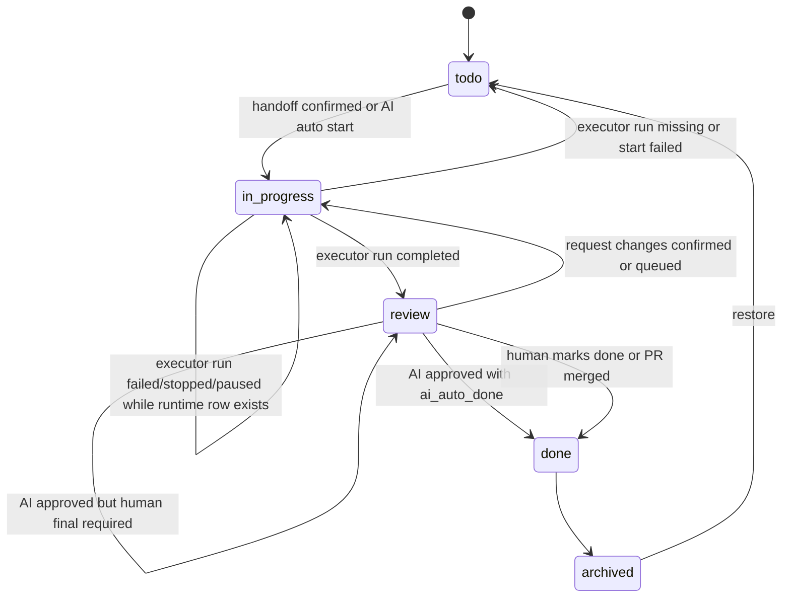

# Workspace TODO Board Execution Runtime Design

## 背景

TODO Board 的 Start 不应只被理解为“创建一个 run”。随着 AI 发放、AI review、fork git worktree 隔离和外部 agent runtime 引入，TODO 从 `todo` 进入 `in_progress` 需要先完成一组执行编排决策：

1. 谁发放任务：用户确认、AI 建议后用户确认，还是 AI 自动发放。
2. 在哪里执行：当前 workspace，还是独立 fork git worktree。
3. 由哪个 runtime 执行：Agent Teams 本地 role、绑定外部 agent 的 role，还是 orchestration preset。
4. 是否允许排队：并发上限满时是否进入 `in_progress` 并创建 queue ticket。
5. 如何 review：人 review、AI 预 review 后人确认，还是 AI review 通过后自动 done。

当前项目已经有独立的 agent runtime 体系。设计上 TODO Board 不直接调用 ACP、A2A、CLI 或本地 provider，而是通过现有 sessions/runs 和 role/runtime 配置执行：

- `RoleDefinition.bound_agent_id = null`：该 role 使用 Agent Teams 本地 provider/runtime。
- `RoleDefinition.bound_agent_id = "<agent>"`：该 role 通过已配置的 external agent runtime 执行，底层协议可以是 `acp`、`a2a` 或 `cli`。
- `RunRuntimeRepository` 统一记录 run runtime 状态：`queued`、`running`、`paused`、`stopping`、`stopped`、`completed`、`failed`。

因此 Boards 模块只保存 runtime target 选择、queue ticket、attempt history 和 execution references，不新增另一套 agent runtime 调度器。

## 设计原则

- TODO Board 不直接实现 ACP/A2A/CLI 调度，只选择 runtime target 并调用 sessions/runs。
- 并发、queue 和 source scope 以解析后的 `board_workspace_id/source_workspace_id` 为准；`view_workspace_id` 只是用户当前页面上下文，fork view 不拆出独立并发池。
- `in_progress` 表示“已发放或处理中”，不再等同于“run 已创建”。
- 卡片细节从 queue ticket、attempt phase、run runtime status、review state 和 diagnostics 派生，不新增 Hermes 式公共子标签体系。
- 并发限制使用 Workspace+Runtime 双口径，避免同一 workspace 被过多任务同时改动，也避免单个外部 runtime 被过度占用。
- AI 发放必须走和用户发放相同的 preview/render/final prompt/start 管线。
- AI review 是 review 阶段的一种执行动作，不改变 Board status owner；最终 `done` 仍由 board lifecycle transition 写入。

## Runtime Target

`RuntimeTarget` 是 TODO Board 面向用户和 AI 的执行选择模型。它不是低层 provider 配置，也不是直接的 external agent config。

| Kind | 含义 | 映射到现有项目 |
| --- | --- | --- |
| `local_role` | 使用 Agent Teams 本地 runtime 的 role | `RoleDefinition.bound_agent_id = null` |
| `external_role` | 使用外部 agent runtime 的 role | `RoleDefinition.bound_agent_id` 指向 `agents.json` 中的 agent |
| `orchestration_preset` | 使用 orchestration preset 执行 | `SessionMode.ORCHESTRATION` + `orchestration_preset_id` |

### Runtime Target 字段

目标模型：

| 字段 | 说明 |
| --- | --- |
| `runtime_target_id` | 稳定 target id，例如 `role:main_agent`、`role:codex_external`、`preset:feature_work` |
| `runtime_target_kind` | `local_role`、`external_role`、`orchestration_preset` |
| `display_name` | UI 展示名 |
| `role_id` | role target 时使用 |
| `orchestration_preset_id` | orchestration target 时使用 |
| `bound_agent_id` | external role 时展示和诊断使用 |
| `external_protocol` | `acp`、`a2a`、`cli`，仅 external role 有值 |
| `external_transport` | `stdio`、`streamable_http`、`custom`，仅 external role 有值 |
| `capabilities` | 是否支持代码修改、是否支持长任务、是否建议隔离执行等 |
| `enabled` | 当前是否可选 |
| `diagnostics` | 不可用原因，例如 role 不存在、外部 agent 未配置、secret 缺失 |

### Runtime Target 来源

`RuntimeTargetService` 从现有配置生成可选项：

- role registry：读取 primary roles、normal mode roles 和用户可见 roles。
- external agent config：通过 role 的 `bound_agent_id` 展示 runtime 协议和 transport。
- orchestration settings：读取可用 orchestration preset。
- workspace/source 配置：过滤 allowed targets，并给出默认 target。

Boards 模块不读取外部 runtime secret，也不直接启动外部 agent process。

## Handoff Initiator 和 Start Policy

任务发放有两个维度：谁提出、是否需要人确认。

| 字段 | 值 | 说明 |
| --- | --- | --- |
| `handoff_initiator` | `human` | 用户点击 Start 或 Request Changes |
| `handoff_initiator` | `ai_suggested` | AI 建议发放，等待用户确认 |
| `handoff_initiator` | `ai_auto` | AI 根据策略自动发放 |
| `start_policy` | `human_required` | 必须用户确认 final prompt 后启动 |
| `start_policy` | `ai_suggest_then_confirm` | AI 生成建议和 prompt，用户确认后启动 |
| `start_policy` | `ai_auto_start` | AI 可自动确认 final prompt 并进入 queue/start |

AI 发放规则：

- AI 只能选择 source/workspace policy 允许的 runtime target。
- AI 自动发放仍必须生成可审计的 `final_prompt`。
- AI 自动发放不能跳过 execution policy、concurrency policy 或 fork workspace 策略。
- 如果并发已满，AI 自动发放默认 `queue_if_full = true`，进入 `in_progress` 并创建 queue ticket。
- 如果 preview/render 失败，AI 不得直接拼接临时 prompt 启动，应记录 diagnostics 并保持 item 在 `todo`。

## Execution Facts and Attempt Phase

Board status 仍只有 `todo`、`in_progress`、`review`、`done`、`archived`。Boards 不定义对外公共的 `queued`、`preparing_workspace`、`running`、`paused`、`ai_reviewing` 子状态。细节展示由以下事实派生：

| 事实 | Board status | 含义 | 是否占 active slot |
| --- | --- | --- | --- |
| active queue ticket exists | `in_progress` | 已发放但等待并发 slot | 否 |
| attempt claimed slot, no run yet | `in_progress` | 正在 fork 或解析 execution workspace，或正在创建 session/run | 是 |
| `RunRuntimeStatus=queued/running/paused/stopping` | `in_progress` | run 已创建，展示来自 run runtime | 是 |
| AI review queue ticket exists | `review` | AI review 已请求但等待 reviewer runtime slot | 否 |
| AI review attempt claimed slot or review run active | `review` | AI review 已获得 reviewer slot，或 review run 处于 `queued/running/paused/stopping` | 占 reviewer slot |
| unresolved diagnostics exists | any non-archived status | 有需要关注的失败或警告 | 否 |

实现阶段可以在 `BoardTodoAttempt` 上保存内部 `attempt_phase`，例如 `waiting_for_slot`、`preparing_workspace`、`starting_run`、`waiting_for_review_runtime`。这些值只用于恢复、诊断和 UI 文案派生，不是新的 board 状态，也不是 source adapter 需要理解的状态。

`waiting_for_review_runtime` 和普通 queue ticket 一样只是等待事实，不占 reviewer runtime active slot；只有 claim 成功后的 AI review attempt 或已创建的 review run 才计入 reviewer runtime active 数。

## 并发策略

### 限制口径

首版采用 Workspace+Runtime 双口径：

| Scope | 默认值 | 说明 |
| --- | --- | --- |
| `max_active_per_source_workspace` | `2` | 同一个 `board_workspace_id/source_workspace_id` 同时 active 的 TODO 数；fork view workspace 不单独计算 |
| `max_active_per_runtime_target` | `1` | 同一个 runtime concurrency key 同时 active 的 TODO 数 |

Runtime concurrency key 不是永远等于 UI 选择的 `runtime_target_id`：

- `local_role` 使用 Agent Teams 本地 provider/runtime key，通常可由 role id 加 workspace provider 配置派生。
- `external_role` 必须使用底层 `RoleDefinition.bound_agent_id` 或外部 runtime identity 作为 concurrency key；两个 role 绑定到同一个 external agent 时共享同一个 slot 池。
- `orchestration_preset` 使用 preset id 作为 orchestration-level key，并在内部为每个实际 role/runtime target 再检查对应的 runtime key。

配置优先级：

1. runtime target override。
2. source override。
3. workspace override。
4. global default。

低层覆盖高层。没有配置时使用上面的保守默认值。

### Active Slot 计算

占用 active slot 的事实：

- attempt 已 claim slot，正在准备 execution workspace。
- attempt 已 claim slot，正在创建 session/run。
- `RunRuntimeStatus = queued`
- `RunRuntimeStatus = running`
- `RunRuntimeStatus = paused`
- `RunRuntimeStatus = stopping`

不占用 active slot 的事实：

- 仅有 active queue ticket，尚未 claim slot。
- `review` 且没有 AI review run。
- `done`
- `todo`
- `archived` 且没有 non-terminal executor run
- terminal failed/stopped/missing 且已经完成 reconcile。

如果 item 已 archived 但仍有 executor run 处于 `queued/running/paused/stopping`，该 run 继续占用 workspace/runtime active slot，直到 stop/cancel 后进入 terminal 并完成 reconcile。

AI review 使用 reviewer runtime target 的并发 slot，不继续占用 executor runtime target slot。这样执行完成的任务不会因为等待 AI review 阻塞后续实现任务。

### Queue Ticket

当 Start、Request Changes 或 AI Review 被确认，但对应并发口径已满：

1. Start/Request Changes 让 board item 进入 `in_progress`；AI Review 让 item 保持 `review` 并设置 review queue state。
2. 创建 `BoardTodoAttempt`。
3. 在同一事务中先保存完整 final prompt 的持久化 snapshot/ref，再创建 queue ticket 并写入 `queue_ticket_id`。
4. queue ticket 必须在对外可见前已经持有可用 `prompt_ref` / `handoff_snapshot_ref`；摘要 metadata 只能用于展示和审计，不能作为后续执行输入。
5. 不创建 session/run，不 fork workspace。

slot 可用后，`queue_kind=start` / `queue_kind=request_changes` 走 executor 分支：

1. `ExecutionQueueService` 选择下一个 ticket。
2. 重新验证 snapshot 中的 executor runtime target 仍存在、可用、allowed，且其 normalized runtime concurrency key 与用户确认时的语义一致；若 unavailable/rebound，ticket failed，item 恢复原状态并写 diagnostic。
3. 原子抢占 `board_workspace_id/source_workspace_id` slot 和 normalized runtime concurrency key slot，而不是按 UI `runtime_target_id` 直接计数。
4. claim queue ticket，写入 `claim_token`、`claim_expires_at`、`claimed_by`。
5. 通过 prompt snapshot/ref 读取完整 final prompt。
6. 根据 `execution_policy` 创建或复用 execution workspace；如果 fork 已创建，必须立即把 `execution_workspace_id` 持久化到 ticket/attempt。
7. 写入 run creation idempotency key 或 pre-bind reservation，再创建 session/run；重试时先按该 key 查找已有 run。
8. run 创建并绑定成功后，原子标记 ticket 为 `completed`，清理 item 上的 `queue_ticket_id`，再由 `RunRuntimeStatus` 驱动卡片展示。

`queue_kind=ai_review` 走 reviewer-only 分支：

1. `ExecutionQueueService` 只抢占 reviewer runtime concurrency key，不抢占 `board_workspace_id/source_workspace_id` executor slot。
2. claim AI review ticket，读取 review prompt snapshot 和既有 execution context。
3. 不创建或 fork execution workspace；AI review 使用已完成 executor attempt 的 workspace/session/run summary 作为 review context。
4. 创建 review run 后，标记 AI review ticket `completed`，清理 review queue 引用，后续由 `review_run_id` 和 review decision 驱动。

如果 fork 或 run 创建失败：

- item 恢复到该 queue ticket 创建前的原 board status：Start 回到 `todo`，Request Changes 回到 `review`。
- Request Changes 失败恢复到 `review` 时，必须重新绑定或可查询到上一轮 completed executor attempt 的 session/run context；如果 item 当前引用已清空，则 card detail 和下一次 request changes 从 attempt history 中读取 prior review context。
- 清理 queue ticket 和 active slot。
- attempt 标记为 failed。
- 保留 `last_status_reason`、event 和 diagnostics。
- 不创建半绑定 session/run。

### Handoff Prompt Snapshot

排队 handoff 必须保存完整 final prompt snapshot，因为 queue ticket 创建时还没有 run/message history 可依赖。目标可以新增 `board_todo_handoff_prompts` 表，或使用等价的 prompt snapshot 存储，但至少需要以下字段：

| 字段 | 说明 |
| --- | --- |
| `prompt_ref` | prompt snapshot id，供 attempt 和 queue ticket 引用 |
| `todo_id` | 关联 TODO |
| `attempt_id` | 关联 start、request changes 或 AI review attempt |
| `template_source` | source/workspace/global/fallback 或 AI suggested source |
| `final_prompt_snapshot` | 用户或 AI policy 最终确认的完整 prompt |
| `created_at` | snapshot 创建时间 |

run 创建成功后，完整 prompt 仍会进入 session/run message history。Board 侧 prompt snapshot 用于 queue 恢复、审计和失败诊断；可以在后续清理策略中压缩或保留摘要，但不能在 run 创建前只保存摘要。

### Queue Lease 和恢复

Queue ticket 需要 lease/claim 语义，避免 queue worker 或服务进程崩溃后永久占用 slot。

目标字段：

| 字段 | 说明 |
| --- | --- |
| `queue_ticket_id` | ticket id |
| `todo_id` | 关联 TODO |
| `attempt_id` | 关联 attempt |
| `queue_kind` | `start`、`request_changes`、`ai_review` |
| `board_workspace_id` | queue 所属 root board workspace |
| `source_workspace_id` | source workspace |
| `view_workspace_id` | 创建 ticket 时的当前页面 workspace，用于审计和 UI 说明 |
| `execution_workspace_id` | 已准备好的 execution workspace；pending ticket 可为空 |
| `prompt_ref` | final prompt snapshot id；Start、Request Changes、AI Review queue worker 必须从这里读取执行 prompt |
| `handoff_snapshot_ref` | runtime/execution/review choices snapshot id，可与 `prompt_ref` 合并实现 |
| `execution_policy` | confirmed execution policy，至少支持 `fork_git_worktree`、`current_workspace` |
| `fork_name` | 用户确认的 fork 名称；只在 `fork_git_worktree` 时使用 |
| `start_ref` | 用户确认的 fork 起点；只在 `fork_git_worktree` 时使用 |
| `runtime_target_id` | executor 或 reviewer runtime target |
| `queued_at` | 入队时间 |
| `claim_token` | 抢占 token |
| `claim_expires_at` | claim lease 过期时间 |
| `claimed_by` | queue worker 或 service instance |
| `status` | `pending`、`claimed`、`completed`、`failed`、`cancelled` |
| `failure_count` | queue/start 失败次数 |

恢复规则：

- `pending` ticket 不占 active slot。
- `claimed` ticket 在 `claim_expires_at` 前占 active slot。
- `claimed` ticket 过期且尚未创建 run 时，释放 slot 并回到 `pending`，写 `queue_ticket_stale` diagnostic。
- 如果过期前已经创建 `execution_workspace_id` 但尚未创建 run，恢复流程必须复用 ticket 上持久化的 execution workspace，或显式取消 ticket 并交给 workspace 删除流程清理该 fork；不得静默再创建第二个 fork。
- 如果 session/run 创建调用可能已经成功但 ticket 还未绑定，恢复流程必须用 run creation idempotency key 查找并绑定已有 run；找不到时才允许重试创建。
- 已创建 run 的 ticket 由 run runtime lifecycle 接管，不再靠 queue lease 判断执行状态。
- session deleted、run missing 或 fork failed 必须释放 slot 并更新 attempt/event/diagnostic。

### Max Runtime 和连续失败

TODO execution policy 可以包含 `max_runtime_seconds`，用于限制自动发放或长任务占用 runtime slot 的时间。

规则：

- 超时检测不直接 kill 外部 runtime；它通过现有 run/session 控制路径请求停止。
- 停止后 attempt 标记为 failed 或 timed out，slot 释放。
- item 根据状态机回到 `todo` 或停在 `review` 等待人工处理。
- 连续 start/runtime failure 达到阈值后，不新增 `blocked` board 状态，只写 `continuous_start_failure` diagnostic，并阻止 AI auto start 继续重试，直到用户清理诊断或手动重新发放。

### Queue Ordering

首版排序规则：

1. 用户手动确认优先于 AI 自动发放。
2. 同一优先级按 `queued_at` FIFO。
3. 同一 source workspace 内不得因为 runtime target 不同而绕过 workspace 上限。
4. 同一 runtime target 内不得因为 source workspace 不同而绕过 runtime 上限。

后续可以增加 priority、deadline 或 source-specific ordering，但 v1 不需要。

## Execution Workspace 关系

Execution workspace 策略继承 handoff 设计：

| Policy | 说明 |
| --- | --- |
| `fork_git_worktree` | 获得 active slot 后调用 workspace fork 能力创建 `git_worktree` workspace |
| `current_workspace` | 直接在当前 `view_workspace_id` 中创建 session/run；普通 root view 通常等于 source workspace，fork view 下必须是用户显式选择并确认风险后的当前 fork workspace |

`git_worktree` fork workspace 是 execution workspace 或 view workspace，不拥有独立 TODO board。Queue worker 在创建或复用 execution workspace 前必须使用 ticket 上的 `board_workspace_id` 和 `source_workspace_id` 读取 board/source context，不能因为 ticket 来自 fork view 就读取 fork-local source、cursor 或 board item。

因此，`current_workspace` 只影响 execution context，不改变 board/source context。即使 run 创建在 fork view workspace 中，item、source config、cursor、queue scope 仍归属解析后的 `board_workspace_id/source_workspace_id`。

重要顺序：

```text
confirm handoff
-> enter in_progress with queue ticket when no slot
-> acquire slot
-> prepare execution workspace
-> create session/run
-> run runtime lifecycle
```

这意味着排队中的 TODO 不提前 fork worktree，避免大量 queued item 占用磁盘和分支资源。

Board item 目标字段：

| 字段 | 说明 |
| --- | --- |
| `board_workspace_id` | TODO board 归属 workspace；fork view 解析到 root workspace |
| `source_workspace_id` | TODO 所属原 workspace |
| `view_workspace_id` | 当前操作发起 workspace；主要写入 attempt/event metadata |
| `execution_workspace_id` | AGENTS 实际执行 workspace；仅有 queue ticket 时可为空 |
| `execution_branch_name` | fork branch |
| `execution_policy` | `fork_git_worktree` 或 `current_workspace` |
| `forked_from_workspace_id` | fork 来源 workspace |

## AI Review

Review 阶段支持人和 AI 组合。

| review_policy | 行为 |
| --- | --- |
| `human_required` | 执行 run completed 后进入 `review`，等待用户确认或 request changes |
| `ai_pre_review` | 进入 `review` 后自动创建 AI review run；AI 输出结论和摘要，但最终仍由人确认 |
| `ai_auto_done` | AI review 通过后可自动 `review -> done` |

### Review State

| review_state | 含义 |
| --- | --- |
| `not_requested` | 未启用 AI review |
| `waiting_for_slot` | AI review 等待 reviewer runtime slot |
| `running` | AI review run 正在执行 |
| `approved` | AI review 通过 |
| `changes_requested` | AI 建议修改 |
| `needs_human` | AI 不确定或策略要求人最终确认 |
| `failed` | AI review 失败 |

AI review run 与 executor run 分开记录：

- `run_id` 或 `executor_run_id`：执行 TODO 的 run；迁移期可继续使用 `run_id` 作为 executor run 字段名。
- `review_run_id`：AI review 的 run。
- `runtime_target_id`：executor runtime target。
- `review_runtime_target_id`：reviewer runtime target。

Lifecycle bridge 必须按 attempt type 分派 run terminal event。executor run completed/failed/stopped/missing 才能驱动主 board status；AI review run terminal 只能更新 review state/decision，并在 `ai_auto_done` approved 时通过 lifecycle 请求 `review -> done`。

### Review Decision

AI review 输出必须被归一化为结构化 decision：

| decision | Board 行为 |
| --- | --- |
| `approved` + `human_required` | 停在 `review`，展示 AI 摘要 |
| `approved` + `ai_pre_review` | 停在 `review`，展示 AI 摘要，等待用户最终确认 |
| `approved` + `ai_auto_done` | `review -> done` |
| `changes_requested` | 停在 `review`，展示建议，用户可一键进入 request changes |
| `needs_human` | 停在 `review` |
| `failed` | 停在 `review`，记录 diagnostics |

AI review 不应自动触发 request changes。即使 AI 认为需要修改，也应先停在 `review`，除非未来单独设计 AI 自动返工策略。

## API 方向

具体 wire shape 在实现阶段写入 core API 文档。这里定义 Boards 模块设计语义。

### Preview Start

```text
POST /api/boards/todos/{todo_id}:preview-start
```

Request 目标字段：

```json
{
  "view_workspace_id": "workspace-current-view",
  "template_override": null,
  "execution_policy": null,
  "runtime_target_id": null,
  "review_policy": null,
  "review_runtime_target_id": null,
  "queue_if_full": true
}
```

Preview request 中的 `view_workspace_id` 表示当前 TODO 页面所在 workspace；fork view 下必须用它渲染 fork warning、workspace variables 和 `current_workspace` execution context，不能只从 `todo_id` 推导 root board workspace。`queue_if_full` 是 Start editor 当前候选值。后端必须基于该值计算 `queue_preview`，避免预览显示会排队而最终 Start 因 `queue_if_full=false` 返回 conflict。

Response 目标字段：

```json
{
  "todo_id": "btodo_123",
  "board_workspace_id": "root_workspace",
  "view_workspace_id": "fork_workspace",
  "is_fork_view": true,
  "prompt": "rendered prompt",
  "recommended_execution_policy": "fork_git_worktree",
  "recommended_runtime_target": {
    "runtime_target_id": "role:main_agent",
    "runtime_target_kind": "local_role",
    "display_name": "Main Agent"
  },
  "runtime_options": [],
  "review_policy": "human_required",
  "review_runtime_options": [],
  "concurrency_snapshot": {
    "source_workspace": {
      "workspace_id": "root_workspace",
      "limit": 2,
      "active": 1,
      "available": 1
    },
    "runtime_target": {
      "limit": 1,
      "active": 1,
      "available": 0
    }
  },
  "queue_preview": {
    "would_queue": true,
    "reason": "runtime target concurrency limit reached"
  },
  "diagnostics": []
}
```

### Start

```text
POST /api/boards/todos/{todo_id}:start
```

Request 目标字段：

```json
{
  "final_prompt": "user or AI confirmed prompt",
  "idempotency_key": "start-btodo-123-attempt-1",
  "view_workspace_id": "workspace-current-view",
  "execution_workspace_id": null,
  "execution_policy": "fork_git_worktree",
  "runtime_target_id": "role:main_agent",
  "queue_if_full": true,
  "start_policy": "human_required",
  "handoff_initiator": "human",
  "review_policy": "ai_pre_review",
  "review_runtime_target_id": "role:reviewer",
  "fork_name": "workspace-btodo-123",
  "start_ref": null,
  "yolo": true
}
```

Rules：

- `final_prompt` 必须非空。
- `idempotency_key` 用于去重 confirmed Start 请求；所有 initiator 都必须提交稳定 key，避免 retry 创建重复 fork/session/run。
- `runtime_target_id` 必须在 allowed runtime targets 中。
- `review_policy=ai_pre_review` 或 `ai_auto_done` 时，`review_runtime_target_id` 必须存在且在 allowed reviewer runtime targets 中；否则 Start 请求应被拒绝，或用户/AI 必须显式降级为 `human_required`。
- `view_workspace_id` 必须随 confirmed Start 提交，表示用户或 AI 发放发生时所在页面 workspace；它用于 audit，也用于解析 `execution_policy=current_workspace`。
- `execution_workspace_id` 在 `fork_git_worktree` 时通常为空并由后端 fork 后写入；在 `current_workspace` 时可以由前端提交为当前 `view_workspace_id`，后端必须校验二者一致，不能从 `todo_id` 推导 root `board_workspace_id` 作为执行 workspace。
- `queue_if_full = true` 时，并发满则进入 `in_progress` 并创建 queue ticket。
- `queue_if_full = false` 时，并发满返回 conflict，item 保持 `todo`。
- AI auto start 必须提交 `handoff_initiator = ai_auto`、`start_policy = ai_auto_start` 和稳定 `idempotency_key`；重复请求返回已有 attempt、queue ticket 或 run 引用。
- `fork_git_worktree` 只在 slot 获取后执行。

### Request Changes

Request changes 与 Start 共享 runtime/concurrency 语义：

- 默认复用原 `execution_workspace_id`。
- 如果 request changes 从该 TODO 的 execution fork 页面发起，`view_workspace_id` 可以作为复用 execution workspace 的快捷提示；最终仍以 item 上的 `execution_workspace_id` 为准。
- 默认复用 executor `runtime_target_id`。
- 无论复用还是显式更换 executor runtime target，都必须在 confirmed Request Changes 时重新检查 allowed targets、runtime availability 和并发上限。
- 并发满且 `queue_if_full = true` 时，item 进入 `in_progress` 并创建 request changes queue ticket。
- legacy review item 如果缺少 `execution_workspace_id` 但有旧 `session_id`，迁移期只能从旧 session workspace 或旧 completed attempt workspace 推导 execution workspace；不能使用当前 `view_workspace_id`。无法证明原执行 workspace 时返回 conflict；目标数据必须写入明确 execution workspace 引用。

### AI Review

目标内部 API 或 service method：

```text
POST /api/boards/todos/{todo_id}:start-ai-review
```

首版可以不暴露给普通前端按钮，而由 lifecycle 在 run completed 后根据 `review_policy` 触发。

Rules：

- 只允许从 `review` 触发。
- 必须存在有效 completed executor attempt、session/run summary 和 execution workspace context；缺失时保持 `review`，写 `review_context_missing` diagnostic，不创建 reviewer run。
- 必须使用稳定 idempotency key，建议由 `todo_id + completed_executor_attempt_id + review_policy + reviewer_runtime_target_id` 派生；重复 lifecycle replay 返回已有 review attempt、queue ticket 或 review run。
- 触发前必须确认没有 active `ai_review` attempt 或 pending/claimed AI review ticket；已有 reviewer attempt 时只更新 diagnostics/event，不创建重复 run。
- 触发时必须重新验证 `review_runtime_target_id` 仍存在、可用且在 allowed reviewer runtime targets 中；若 role/agent 被删除、禁用或 capability drift，item 保持 `review`，写 `review_runtime_unavailable` diagnostic，或显式降级为 `human_required`。
- reviewer runtime target 独立计入 runtime 并发。
- review run 完成后归一化 decision。
- `ai_auto_done` 只有在 decision 为 `approved` 时才能进入 `done`。

## 状态流转补充



## 持久化方向

目标持久化可以拆成三类：

1. Board item 上的当前引用：
   - `runtime_target_id`
   - `runtime_target_kind`
   - `review_policy`
   - `review_state`
   - `review_run_id`
   - `current_attempt_id`
   - `active_attempt_id`
   - `queue_ticket_id`
2. Queue ticket 表：
   - `queue_ticket_id`
   - `todo_id`
   - `board_workspace_id`
   - `source_workspace_id`
   - `view_workspace_id`
   - `execution_workspace_id`
   - `prompt_ref`
   - `handoff_snapshot_ref`
   - `execution_policy`
   - `fork_name`
   - `start_ref`
   - `runtime_target_id`
   - `review_runtime_target_id`
   - `queue_kind`，例如 `start`、`request_changes`、`ai_review`
   - `queued_at`
   - `priority`
   - `prompt_ref`，引用完整 final prompt snapshot
   - `handoff_snapshot_ref`，引用用户确认后的 execution/runtime/review 选择；queue worker 必须从该 snapshot 读取 fork 策略、fork 名称和起点
   - `claim_token`
   - `claim_expires_at`
   - `claimed_by`
   - `failure_count`
   - `status`
   - `diagnostics`
3. Handoff prompt snapshot 表或等价存储：
   - `prompt_ref`
   - `todo_id`
   - `attempt_id`
   - `template_source`
   - `final_prompt_snapshot`
   - `created_at`
4. Runtime policy 配置：
   - workspace-level concurrency defaults。
   - source-level overrides，以 `board_workspace_id/source_workspace_id/source_id` 为作用域。
   - runtime target overrides。
   - allowed runtime targets。

如果实现阶段新增 schema，必须同步更新 `docs/core/database-schema.md`。

## 前端表现

主看板仍保持四个主列：`todo`、`in_progress`、`review`、`done`。前端可在每列内按来源 group 折叠展示，也可切换到 mixed 模式平铺展示；这只是视图模式，不新增 board 状态。

卡片展示从事实派生：

- queue ticket：等待哪个 slot、queued time、queue kind。
- attempt：当前 attempt 类型、是否已 claim slot、是否已有 execution workspace。
- run runtime：`queued`、`running`、`paused`、`stopping`、`completed`、`failed`。
- review：review policy、review attempt、AI decision。
- diagnostics：未清理 warning/error/critical。

Start prompt editor 需要展示：

- board scope：root board workspace、当前 view workspace，以及是否为 fork view。
- runtime target selector。
- execution policy selector。
- concurrency preview。
- `queue_if_full` 控件。
- review policy selector。
- reviewer runtime target selector。

AI suggested start 应展示为一个待确认建议：用户可以打开同一个 Start prompt editor，看到 AI 选择的 prompt、runtime、execution policy 和 review policy，并可修改后确认。

## 测试矩阵

| 场景 | 期望 |
| --- | --- |
| local role target | preview 可选择，start 创建 normal session/run |
| external role target | preview 展示 bound agent protocol/transport，start 仍通过 sessions/runs |
| orchestration preset target | start 创建 orchestration session/run |
| runtime target 不可用 | preview 返回 diagnostics，start 拒绝 |
| board/source workspace active 达到 2 | 按 `board_workspace_id/source_workspace_id` 统计，新 handoff 进入 `in_progress` 并创建 queue ticket |
| runtime target active 达到 1 | 新 handoff 进入 `in_progress` 并创建 queue ticket |
| Start with `queue_if_full=false` | 并发满时返回 conflict，item 保持 `todo` |
| Request Changes with `queue_if_full=false` | 并发满时返回 conflict，item 保持原 `review` 状态 |
| queue ticket 获得 slot | claim ticket，准备 workspace，创建 session/run，后续由 run runtime 驱动 |
| queue ticket 获得 slot | 必须先读取完整 prompt snapshot，再创建 session/run |
| fork 失败 | item 回到 `todo`，不创建 run，不占 slot |
| queue claim 过期 | 释放 slot，ticket 恢复或失败，写 diagnostic |
| max runtime exceeded | 请求停止 run；slot 保持占用直到 runtime 进入 stopped/failed terminal 并完成 reconcile，然后写 attempt failure |
| 连续 start failure 达阈值 | 写 diagnostic，阻止 AI auto retry，不新增 board 状态 |
| run completed + human_required | `in_progress -> review` |
| run completed + ai_pre_review | 创建 AI review attempt；AI 通过后仍停 `review` |
| run completed + ai_auto_done | AI approved 后 `review -> done` |
| AI review changes_requested | 停 `review`，显示建议，不自动返工 |
| AI review run terminal | 只更新 review state/decision，不执行 executor run 状态映射 |
| linked PR merged while in_progress | 只记录 evidence，保持 `in_progress` |
| request changes slot 满 | `review -> in_progress`，创建 request changes queue ticket |
| fork view start | 并发统计使用 root board/source workspace，不按 fork view workspace 分裂 |
| fork view queued ticket | ticket 保存 `board_workspace_id`、`view_workspace_id` 和后续 `execution_workspace_id` |
| request changes from execution fork | 复用 item 已绑定 execution workspace |
| legacy review item without execution workspace | request changes fallback 到 `current_workspace` |
| session deleted while queued | 清理 ticket，回到 `todo` |
| session deleted while done | 保持 `done`，清理 session/run refs |

## 实现阶段注意事项

- Queue ticket 和 slot 获取必须有原子性，避免两个 worker 同时启动超过上限的 TODO。
- `run_runtime` 是 run 状态 source of truth；Boards 只做映射和引用清理。
- external agent runtime 的 secret、transport 解析仍归 `agent_runtimes` 和 role/provider 层。
- AI auto start 和 AI auto done 都必须产生可审计 metadata：initiator、policy、runtime target、template source、decision summary。
- 文档中的 API 和 schema 是目标设计，实现时若落地公共接口必须同步 core API/schema 文档。
