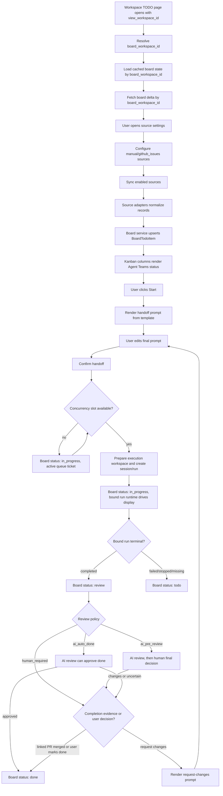

# Workspace TODO Board Overview

## 背景

Workspace TODO Board 是 Agent Teams 内部拥有的 workspace 工作项看板。它面向用户的核心价值不是复制 GitHub、Linear 或其他外部 tracker 的完整看板，而是把“可以交给 AGENTS 执行的工作项”集中到一个统一流程里：

1. 从一个或多个 source 导入候选 TODO。
2. 在 Agent Teams 中持久化 board item 和 board 状态。
3. 由用户选择一个 TODO，编辑交付 prompt 后交给 AGENTS。
4. 绑定 dedicated session/run，跟踪执行状态。
5. 执行完成后进入 review，用户验收或通过 PR merged evidence 完成。

现有实现已经有 `/api/boards/todos*`、`BoardTodoService`、`BoardTodoRepository` 和前端 TODO 看板，但当前设计仍偏 v1：

- GitHub source 从 workspace git remote 自动探测，用户不能显式配置。
- Start 操作直接调用后端，后端用内置 `_build_start_prompt()` 拼接提示词。
- `src/relay_teams/boards/` 内同时存在真实 TODO board 实现和旧 `TaskBoardAdapter`/dispatcher 抽象，边界不够清楚；旧 task-board adapter API 后续应规划删除，而不是继续作为 TODO Board 扩展入口。

本设计把 TODO Board 重新定义为一个清晰的 boards domain 子系统，并拆分 source、state lifecycle、handoff 和 persistence 职责。

## 目标

- 支持 workspace 级 TODO source 配置。v1 source 包括 `manual` 和 `github_issues`，未来可扩展 Linear、Jira、internal task、custom API 等。
- 明确 board 状态只由 Agent Teams 拥有，外部系统不直接决定 TODO card 所在列。
- 明确 board 状态与 session/run runtime 状态之间的映射，避免 run 已失败但 card 仍停在 `in_progress`。
- 支持 AGENTS handoff prompt 由用户编辑后再触发，同时支持可配置模板。
- 支持 AI 发放、AI review 和 AI 自动放行到 `done`，但这些自动化必须受模板、runtime target、execution workspace 和并发策略约束。
- 支持不同 TODO 绑定不同 runtime target，包括本地 role、绑定外部 agent runtime 的 role，以及 orchestration preset。
- 支持 attempt/run history、comments/events、diagnostics、idempotency 和 TODO-bound worker context，使 TODO card 自身具备可审计协作上下文。
- 支持 root workspace 与由它 fork 出来的 `git_worktree` execution workspace 共享同一套 TODO board；fork workspace 的 TODO 页面是 root board 的视图，不创建独立 board 数据。
- 重建 Boards 模块目录结构，把旧通用 board adapter 中可复用的读取/归一化思路迁移到新的 source adapter；旧 `/api/boards/{board_id}/tasks`、`/api/boards/state-map` 和双向 tracker state 语义规划删除。
- 保持现有 `/api/boards/todos*` 能力可平滑迁移，避免一次性破坏前端和已有测试。

## 非目标

- 不把 GitHub Projects、Linear board column 或 Jira workflow 作为 Agent Teams board 状态的 source of truth。
- 不在 Boards 模块内重新实现 session/run 调度。
- 不让 interface/router 直接访问 repository。
- 不把 run-local `todo_read`/`todo_write` 工具状态合并进 Workspace TODO Board；二者是不同层级的 TODO。
- 不在 v1 中完整实现所有未来 source，只定义扩展接口和边界。
- 不设计 TODO 之间的 parent/child dependency graph；TODO 来源和调度流程都是线性的。
- 不照搬 Hermes Kanban 的 `triage`、`ready`、`blocked` 等状态体系。等待、运行、暂停、AI review 等展示必须从 Agent Teams 自己的 queue ticket、run runtime status、review state 和 diagnostics 派生。
- 不让 fork 出来的 `git_worktree` workspace 拥有独立 `board_todo_sources`、`board_todo_source_state`、`board_todo_items` 或独立 revision；它们共享 root board。

## 核心概念

### Board Item

`BoardTodoItem` 是 Agent Teams 持久化的 TODO card。它包含：

- Agent Teams 自有字段：`todo_id`、`board_workspace_id`、`source_workspace_id`、`status`、`title`、`body`、`session_id`、`run_id`、`review_run_id`、`item_revision`、`created_at`、`updated_at`。
- source 引用字段：`source_id`、`source_key`、`source_url`、`source_updated_at`、source-specific reference。`workspace_id` 可在迁移期继续表示 source workspace；`source_provider`/`source_type`/`source_key` 是 legacy 兼容和展示字段，不再作为目标 identity。
- completion evidence 字段：linked PR、merged status、source completion evidence 等。
- lifecycle 诊断字段：`last_status_reason`、`archived_at`、`last_synced_at`。

Board item 的 `status` 是 Agent Teams 自己的状态，不等于 GitHub issue state、Linear issue state 或 run runtime status。

### Board Workspace Scope

TODO 页面需要区分“用户当前打开的 workspace”和“TODO board 真正归属的 workspace”：

| 字段 | 说明 |
| --- | --- |
| `view_workspace_id` | 用户当前打开的 workspace，可能是 root project workspace，也可能是 fork 出来的 `git_worktree` execution workspace |
| `board_workspace_id` | TODO board 的持久化归属 workspace；普通 workspace 等于 `view_workspace_id`，fork workspace 解析为最终 root workspace |
| `source_workspace_id` | TODO source 所属 workspace；当前设计下通常等于 `board_workspace_id` |
| `execution_workspace_id` | AGENTS 实际执行 workspace，可以是从 root/source workspace fork 出来的独立 worktree |

所有 board list、delta、source settings、sync、manual create、archive、restore、Start 和 Request Changes 请求即使仍以 `workspace_id` 作为当前页面参数，进入 domain/service 层后也必须先解析：

```text
resolve_board_workspace_id(view_workspace_id)
```

解析规则：

1. 读取 `view_workspace_id` 对应 workspace profile。
2. 如果 `file_scope.backend != git_worktree`，返回自身。
3. 如果是 `git_worktree` fork，必须存在有效 `file_scope.forked_from_workspace_id`，并沿该字段继续追溯，直到最终 root workspace。
4. 解析过程必须有 cycle guard；遇到缺失 parent、cycle、root 缺失或无权限时，不创建 fork-local board，不 fallback 到 `view_workspace_id`，而是返回 diagnostics。

这意味着：

- Root workspace 与所有 fork workspace 的 TODO 页面显示同一组 board items、sources、cursors、templates 和 revision。
- Fork workspace 中创建 manual TODO 或 AI-created TODO 时，item 仍写入 root board；event/attempt metadata 记录 `initiated_from_workspace_id = view_workspace_id`。
- Fork workspace 中打开 source settings 时展示 root board sources；如果允许编辑，实际修改 root board source config，并在 UI 中标明这些配置 shared with root workspace。
- 从 fork workspace 页面触发 sync 时，同步 root board sources 和 root cursors，不把 fork workspace 的 git remote 作为 source identity。
- TODO board cache、revision 和 delta subscription 以 `board_workspace_id` 为主 key；`view_workspace_id` 只作为页面上下文和 execution workspace shortcut。

### Attempt、Comment、Event 和 Diagnostic

TODO item 是逻辑任务，attempt 是一次执行或 review 尝试。Start、request changes 和 AI review 都会形成 attempt history。Board 侧还保存 comment thread、append-only event log 和 diagnostics，避免用户必须打开 session 历史才能理解卡片发生过什么。

详细设计见 [协作审计、Attempt 和诊断设计](workspace-todo-board-collaboration-design.md)。

### Source

Source 是某个 board workspace 内的 TODO 数据来源配置。每个 root board workspace 可以有多个 source；fork workspace 只继承和操作 root board 的 source 配置。

v1 source：

- `manual`：用户在 Agent Teams 内创建的本地 TODO。
- `github_issues`：一个显式或自动探测得到的 GitHub repository 的 issue source。

source 负责提供 source record 和 evidence，不拥有 card column：

- open GitHub issue 可以导入或更新 TODO item。
- closed GitHub issue 可以作为 archive/done reconciliation 的 evidence。
- GitHub PR merged 可以作为 `review -> done` 的 evidence。

### Handoff

Handoff 是用户把 TODO 交给 AGENTS 的动作。它不是单纯的 `start_todo` RPC，而是一个显式用户确认流程：

1. 用户点击 card 上的 Start。
2. 前端请求后端渲染默认 handoff prompt。
3. 用户在弹窗中编辑最终 prompt。
4. 用户确认后，前端提交 final prompt。
5. 后端创建或复用 session/run，并把 item 移到 `in_progress`。

AI 也可以发放 TODO，但 AI 发放不等于绕过 handoff。AI suggested start 生成可编辑建议，由用户确认；AI auto start 则按策略自动提交 final prompt，但仍必须经过同一套模板渲染、runtime target 校验、execution workspace 策略和并发限制。

### Runtime Target

Runtime target 是 TODO 交付时选择的执行后端抽象。TODO Board 不直接调用 provider 或 external agent runtime，而是选择现有 sessions/runs 能理解的执行入口：

- `local_role`：未绑定 `bound_agent_id` 的 Agent Teams role，走本地 provider/runtime。
- `external_role`：绑定了 `bound_agent_id` 的 role，底层可以走 `acp`、`a2a` 或 `cli` agent runtime。
- `orchestration_preset`：通过 `SessionMode.ORCHESTRATION` 使用 orchestration preset。

详细设计见 [执行 Runtime、AI 发放和并发设计](workspace-todo-board-execution-runtime-design.md)。

### Execution Facts

`in_progress` 列表示 TODO 已经发放或正在处理，不再只表示 run 已经创建。更细的展示不由 Boards 再定义一套公共子状态，而是从事实派生：

- 是否存在 active queue ticket。
- queue kind 和 queued time。
- active attempt phase。
- 是否已有 execution workspace。
- 当前 `RunRuntimeStatus`。
- review policy、review state 和 AI review decision。
- 是否存在未清理 diagnostics。

例如并发上限满时，TODO 可以进入 `in_progress`，但卡片展示应表达“存在 start queue ticket，等待 runtime slot”，而不是把 `queued` 变成新的 board domain 状态。

### Lifecycle Bridge

Lifecycle Bridge 是 Boards 和 Sessions/Runs 之间的窄边界：

- run completed 通知 board item 进入 `review`；如果该 item 已经存有可信 linked PR merged evidence，则可直接进入 `done`。
- run failed/stopped/missing 通知 board item 回到 `todo`。
- session deleted 通知 board 清理 stale session/run 引用。
- PR merged 通知 linked `review` item 进入 `done`；如果 item 仍在 `todo` 或 `in_progress`，只记录 completion evidence，不抢占 run lifecycle。

Boards 不直接执行 run，也不决定 run recovery；它只消费 sessions/runs 暴露的生命周期事件。

## 系统边界

### 与 Connectors 的关系

Connectors 负责账号、凭据、可用性和健康状态。Boards 使用 connector 或 trigger account 提供的凭据访问外部 source，但不把 connector overview 当成 board 配置。

示例：

- GitHub connector 显示账号是否可用。
- TODO Board source 配置声明使用哪个 GitHub account/token source 访问 `owner/repo`。

### 与 Sessions/Runs 的关系

Sessions/Runs 负责执行生命周期。Board item 只保存绑定引用：

- `session_id`：从 TODO 启动后创建或复用的 dedicated session。
- `run_id`：当前正在处理或最近一次处理该 TODO 的 run。

Board 不直接写 message history，不直接调用 agent execution loop，也不绕过 `RunService`。

### 与 Agents 的关系

AGENTS 接收用户或 AI 策略确认后的 handoff prompt。模板渲染和编辑发生在 handoff 层，Agent runtime 只看到最终 user prompt。

这保证：

- 用户能理解和修改交付内容。
- 不同 source 可以有不同上下文格式。
- 后端不会偷偷追加用户不可见的核心任务描述。
- AI auto start 也有可审计的 final prompt、runtime target 和 execution policy。

### 与 Agent Runtimes 的关系

Agent runtime 是 role/provider/session-run 层的能力，不属于 Boards 模块。Boards 只记录 runtime target 选择：

- role 没有 `bound_agent_id` 时，执行走 Agent Teams 本地 runtime。
- role 有 `bound_agent_id` 时，执行走配置的 external agent runtime。
- external runtime 的协议和 transport 由 `agent_runtimes` 模块处理。
- run 的实际状态由 `run_runtime` 归一化后回传给 board lifecycle。

### 与 External Trackers 的关系

外部 tracker 是 evidence provider，不是 board state owner。

| 外部事件 | Agent Teams 行为 |
| --- | --- |
| GitHub issue opened/updated | upsert source record 到 TODO item |
| GitHub issue closed without merged PR | 自动 archive 或保持 done，取决于 evidence |
| GitHub issue reopened | 只恢复由 source reconciliation 自动 archive 的 item |
| GitHub PR linked | 记录 linked PR evidence |
| GitHub PR merged | linked `review` item 可进入 `done`；`todo`/`in_progress` item 只记录 evidence |
| Manual archive | 不被外部 sync 自动恢复 |

## 端到端流程



## 用户体验

### 主看板

主看板保持四个工作列：

- `todo`
- `in_progress`
- `review`
- `done`

`archived` 仍是独立视图，不参与主流程列。

每张 card 显示：

- title、body 摘要。
- source provider/type/source label。
- repository 或 source scope。
- board workspace、当前 view workspace 和 execution workspace。
- source 更新时间和 board 更新时间。
- bound session/run。
- linked PR 或 completion evidence。
- status reason。
- queue/run/review 派生展示，例如等待 slot、run paused、AI review pending。
- runtime target 和 execution workspace。
- review state，例如 `AI reviewing`、`AI approved`、`AI requested changes`。
- attempt count、未清理 diagnostic 数量和最近 event 摘要。

### 右上角设置入口

TODO 列表右上角新增设置按钮，打开 source settings 面板。设置面板至少包含：

- source 列表。
- 新增 GitHub issue source。
- 启用/禁用 source。
- 显式 `owner/repo` 配置。
- 自动探测建议。
- 同步状态、最近 sync 时间、diagnostics。
- source 级 handoff template 入口。

这个入口属于 TODO Board 页面，而不是全局 connector 页面。Connector 页面仍只负责账号和健康状态。若用户当前在 fork workspace 的 TODO 页面中打开设置，面板展示 root board 的 sources，并清楚标注这些设置与 root workspace 共享。

### Start Prompt Editor

点击 Start 后不立即创建 run，而是打开 prompt editor：

- 预填后端渲染的 prompt。
- 显示模板来源：source/workspace/global/fallback。
- 显示并允许选择 runtime target。
- 显示 execution workspace 策略和 fork 预览。
- 显示并发预览；如果会排队，明确显示 queue ticket 将被创建以及预计等待的 slot 口径。
- 显示 review policy 和 reviewer runtime target。
- 用户可以编辑。
- 确认后进入 start pipeline：如果并发 slot 可用才准备 execution workspace 并创建 session/run；如果会排队，则只创建 queue ticket 和 prompt snapshot，不提前 fork workspace 或创建 run。

Request changes 也打开类似编辑器，但默认模板包含 `feedback`。

## API 方向

现有 `/api/boards/todos*` 保持作为 board item 和 sync 入口。目标设计新增或调整以下能力：

- scope resolution：
  - request 中的 `workspace_id` 表示当前页面 `view_workspace_id`。
  - response 返回 `board_workspace_id`、`view_workspace_id`、`is_fork_view`、`forked_from_workspace_id`、`source_workspace_id` 和 `execution_workspace_id`。
  - service 层在触碰 board persistence 前统一解析 `board_workspace_id`。
- source 配置：
  - list/create/update/delete workspace sources。
  - test/preview GitHub auto-detect result。
  - per-source sync。
- handoff：
  - preview rendered start prompt。
  - preview rendered request-changes prompt。
  - start with final prompt。
  - request changes with final prompt and feedback metadata。
- execution/runtime：
  - list runtime target options。
  - preview concurrency and queue outcome。
  - start queued handoff when active slots are unavailable。
  - start AI review according to review policy。
- collaboration/audit：
  - list/create comments。
  - list attempt history。
  - list events。
  - list/clear diagnostics。
  - nudge queue reconciliation。
- lifecycle：
  - internal service methods consume run/session/PR lifecycle events。

具体 wire shape 在实现阶段进入 `docs/core/api-design.md`。

## 持久化方向

当前 `board_todo_workspace_state.github_issue_sync_cursor` 是 per workspace/repository 的 GitHub issue cursor。目标设计改为以 `board_workspace_id` 为作用域的 per source cursor：

- `board_todo_sources`：root board workspace source 配置。
- `board_todo_source_state`：每个 source 的 cursor、sync status、diagnostics。
- `board_todo_items`：继续保存 board item，增加 `board_workspace_id`、source id/reference 的稳定字段。
- `board_todo_handoff_templates` 或配置型 JSON：保存 workspace/source 模板覆盖。
- `board_todo_handoff_prompts` 或等价 prompt snapshot：保存排队和 attempt 所需的完整 `final_prompt` snapshot/ref。
- execution queue：保存 queued handoff ticket、runtime target、queue kind、diagnostics 和 prompt snapshot reference。
- runtime policy：保存 workspace/source/runtime target 并发配置和 allowed runtime targets。
- review metadata：保存 AI review run、review policy、review state 和 review decision。
- `board_todo_attempts`：保存 start、request changes 和 AI review attempt history。
- `board_todo_comments`：保存 card-level comment thread。
- `board_todo_events`：保存 append-only audit log。
- `board_todo_diagnostics`：保存可恢复 diagnostics。

具体 schema 在实现阶段进入 `docs/core/database-schema.md`。

## 后续实现验收

- 用户可以在 TODO 页面右上角配置 GitHub repo，而不是只能依赖 git remote。
- Root workspace 和它 fork 出来的 `git_worktree` workspace TODO 页面显示同一组 TODO items、同一 revision 和同一 source settings。
- Fork workspace source settings 展示 root board sources；从 fork 页面编辑 source 或触发 sync 时修改/同步 root board，不创建 fork-local source、cursor 或 item。
- Fork workspace 中手动创建或 AI 创建 TODO 时，item 归属 root board，event 记录 `initiated_from_workspace_id`。
- Root board 更新时，root 页面和所有 fork 页面收到同一个 board delta/invalidation。
- 多个 source 可以同时启用，sync cursor 不互相覆盖。
- TODO item 目标去重键使用 `(board_workspace_id/source_workspace_id, source_id, source_key)`；legacy provider/type/key 只用于迁移兼容和展示。
- Start 和 request changes 都必须经过用户可编辑 prompt。
- 排队的 Start、request changes 和 AI review 必须能通过 prompt snapshot 找回完整 final prompt，摘要不能作为执行输入。
- AI auto start 和 AI review 必须可审计，且不能绕过并发限制。
- Start、request changes 和 AI review 都能形成 attempt history，并在 card detail 中展示。
- Comments、events、diagnostics 能解释 TODO 的协作过程和失败原因。
- Runtime target 可以覆盖本地 role、外部 agent role 和 orchestration preset。
- run/session 生命周期能可靠驱动 card 状态变化。
- 旧 adapter/dispatcher 体系不再作为新 API 扩展方向；可复用逻辑迁移后，旧 `/api/boards/{board_id}/tasks`、`state-map` 和 `TaskBoardAdapter` 规划删除。
