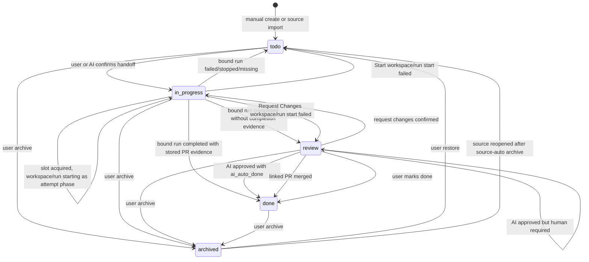

# Workspace TODO Board State Machine

## 设计目标

TODO Board 状态机要解决两个一致性问题：

- Board card 所在列必须反映 Agent Teams 对该 TODO 的处理状态，而不是外部 tracker 的状态。
- Board card 必须与绑定 session/run 生命周期保持一致，不能出现 run 已失败、删除或完成但 card 长期停在错误列。

本设计把状态变化归纳为事件驱动：用户操作、run lifecycle、session lifecycle、source evidence 和 sync reconciliation 都转换为明确的 board transition。

## Board 状态

| 状态 | 含义 | 是否主看板显示 |
| --- | --- | --- |
| `todo` | 可启动，当前没有 active bound run | 是 |
| `in_progress` | 已发放给 AGENTS 或进入执行队列；可能尚未创建 run，也可能绑定当前 run 正在执行或等待恢复 | 是 |
| `review` | bound run 已完成，等待用户验收、AI review 或 completion evidence | 是 |
| `done` | 已完成，通常由用户确认或 linked PR merged 证明 | 是 |
| `archived` | 软删除或 source reconciliation 移出主看板 | 否，独立 archive 视图 |

状态 owner：

- `status` 由 Agent Teams board domain 拥有。
- GitHub issue state、Linear issue state、run runtime status 都不是 board status。
- 外部状态只能作为 transition evidence。

状态机执行前必须先完成 board scope resolution。请求参数中的 `workspace_id` 表示当前页面 `view_workspace_id`；transition、revision、source reconciliation 和 archive/restore 都作用在解析后的 `board_workspace_id` 上。`git_worktree` fork workspace 不拥有独立状态机实例；它展示和操作 root board 的同一批 item。由 fork view 触发的 transition 只在 event/attempt metadata 中记录 `initiated_from_workspace_id`。

## Run Runtime 映射

Board item 通过 executor `run_id` 绑定当前处理 run。AI review 使用独立 `review_run_id`，不能复用 executor `run_id`。Lifecycle bridge 必须先根据 `active_attempt_id` 和 attempt type 判断 run 事件属于 executor attempt 还是 AI review attempt：

- executor run terminal 驱动 `in_progress -> review` 或 `in_progress -> todo`。
- AI review run terminal 只更新 `review_state`、`review_decision` 和 `review_run_id` 相关 attempt；只有 `ai_auto_done` 且 decision 为 approved 时，才通过 lifecycle 执行 `review -> done`。

executor run runtime status 映射如下：

| RunRuntimeStatus | Board 解释 | Board 目标状态 |
| --- | --- | --- |
| `queued` | 已提交，尚未开始执行 | `in_progress` |
| `running` | 正在执行 | `in_progress` |
| `stopping` | 正在停止，尚未到终态 | `in_progress` |
| `paused` | 等待人工输入、审批或恢复 | `in_progress` |
| `completed` | 本次执行完成，进入验收 | `review` |
| `failed` | 本次执行失败，需要重新启动 | `todo` |
| `stopped` | 用户或系统停止，需要重新启动 | `todo` |
| missing run | stale 引用，不能继续显示执行中 | `todo` |

注意：

- `paused` 不应回到 `todo`，因为它仍是可恢复或等待中的 active run。
- `stopping` 不应提前回到 `todo`，避免用户并发启动第二个 run。
- `completed` 只进入 `review`，不直接进入 `done`，除非同时存在完成证据。

## 派生执行事实

`in_progress` 是主列状态，表示 TODO 已被发放或正在处理。Boards 不再定义一套对外公共的 `queued`、`preparing`、`running`、`paused`、`ai_reviewing` 子标签体系。卡片上的细节展示从以下事实派生：

| 事实 | Board status | 说明 |
| --- | --- | --- |
| active queue ticket exists | `in_progress` | handoff 已确认，但 source workspace 或 runtime target 并发 slot 暂不可用；此时允许 `session_id/run_id` 为空，必须能通过 prompt snapshot/ref 找回完整 final prompt |
| active attempt has not created run | `in_progress` | 已获得 slot，正在准备 execution workspace 或创建 session/run；这是内部 attempt phase，不是公共 board 状态 |
| bound run runtime is `queued/running/paused/stopping` | `in_progress` | 展示直接来自 `RunRuntimeStatus` |
| AI review attempt active | `review` | executor run 已完成，AI review run 正在执行或等待 reviewer runtime slot |
| unresolved diagnostics exists | any non-archived status | 表示需要关注的错误或警告，不改变 board status |

实现阶段可以在 attempt 或 queue ticket 上保存内部 phase，例如 `waiting_for_slot`、`preparing_workspace`、`starting_run`。这些 phase 用于恢复和诊断，不作为新的 board column 或跨模块公共状态体系。

## Session 关系

Board item 可以绑定 `session_id`：

- Start 创建 dedicated session，并写入 metadata，例如 `board_todo_id`。
- Request changes 在同一个 session 中创建新 run。
- Session 删除时必须清理 board 引用。

Session 删除规则：

| 当前 board 状态 | 行为 |
| --- | --- |
| `archived` + no active executor/reviewer refs | 不处理，保持 archived |
| `archived` + deleted bound executor/reviewer session | 保持 archived，清理匹配 refs，释放或 reconcile slot，记录 event/diagnostic |
| `done` + deleted executor session | 保持 done，清理 `session_id/run_id`，记录 reason |
| `done` + deleted AI review session | 保持 done，清理匹配的 `review_run_id`，记录 reason |
| `todo` | 清理 `session_id/run_id`，保持 todo |
| `in_progress` | 回到 todo，清理 `session_id/run_id`，取消 pending/claimed queue ticket |
| `review` + deleted executor session | 回到 todo，清理 `session_id/run_id`，取消/supersede active AI review attempt |
| `review` + deleted AI review session | 保持 review，清理 `review_run_id`，将 AI review attempt 标记 failed |

设计理由：

- 已完成 item 不应因 session 删除而失去完成状态。
- 未完成 item 不能继续引用已删除 session。
- `review` 回到 `todo` 只适用于 executor session 被删除的情况，因为用户无法继续检查执行上下文。
- AI review session/run 只影响 reviewer attempt，不拥有 executor lifecycle；删除后 item 保持 `review`，等待人工确认、重新 AI review 或 request changes。

## 状态流转表

| From | Event | Guard | To | Side effects |
| --- | --- | --- | --- | --- |
| `todo` | user confirms handoff | final prompt 非空且 slot available | `in_progress` | save prompt snapshot, acquire slot, prepare execution workspace, then create session/run and bind ids |
| `todo` | user/AI confirms handoff but concurrency full | `queue_if_full=true` | `in_progress` | create queue ticket and start attempt |
| `todo` | AI auto start | allowed source/workspace policy | `in_progress` | same as confirmed handoff; may queue |
| `todo` | user archive | none | `archived` | set `archived_at`, reason |
| `in_progress` | queue ticket acquired slot | active queue ticket exists | `in_progress` | claim ticket, prepare workspace, create session/run, then mark ticket completed and clear `queue_ticket_id` atomically |
| `in_progress` | workspace/run start failed | before run bound | saved prior status (`todo` for Start, `review` for Request Changes) | clear queue/slot refs, reason, record diagnostic |
| `in_progress` | run completed | bound `run_id` matches and linked PR merged evidence already stored | `done` | consume stored completion evidence, keep attempt summary |
| `in_progress` | run completed | bound `run_id` matches | `review` | keep session/run, reason |
| `in_progress` | run failed/stopped | bound executor `run_id` matches | `todo` | move failed session/run refs into attempt history, clear current `session_id/run_id`; next Start creates a new dedicated session |
| `in_progress` | run missing | stale `run_id` | `todo` | clear `session_id/run_id`, reason |
| `todo` | linked PR merged | linked PR evidence | `todo` | record evidence only; do not mark done |
| `in_progress` | linked PR merged | linked PR evidence | `in_progress` | record evidence only; do not interrupt executor lifecycle |
| `in_progress` | user archive | none | `archived` | cancel pending/claimed queue ticket if present; request stop/cancel for active executor run, move current refs into attempt history or detach from item row, hide from main view |
| `review` | request changes confirmed | final prompt 非空且有有效 `session_id` 和 reusable `execution_workspace_id` | `in_progress` | cancel/supersede active AI review attempt if present, archive prior `review_state/review_decision/review_run_id` with old attempt, reset current review metadata, move previous executor run into attempt history, create new run in bound session |
| `review` | request changes confirmed | 缺少有效 review execution context | `review` | return conflict/diagnostic，不创建 disconnected session |
| `review` | request changes confirmed but concurrency full | `queue_if_full=true` 且有有效 review execution context | `in_progress` | cancel/supersede active AI review attempt if present, archive prior `review_state/review_decision/review_run_id` with old attempt, reset current review metadata, move previous executor run into attempt history, clear current executor `run_id`, create queue ticket, reuse execution workspace |
| `review` | AI review started | review policy enabled and valid completed executor context exists | `review` | create or queue review run, set review state |
| `review` | AI review started | missing completed executor context | `review` | write `review_context_missing` diagnostic, do not create reviewer run |
| `review` | AI review queue ticket acquired reviewer slot | active AI review queue ticket exists | `review` | claim ticket, read review prompt snapshot, create review run, mark ticket completed and clear review queue ref atomically |
| `review` | AI review approved | `review_policy=ai_auto_done` | `done` | save AI decision |
| `review` | AI review approved | `review_policy=ai_pre_review` | `review` | save summary, wait human |
| `review` | AI review changes requested | none | `review` | save feedback, offer request changes |
| `review` | linked PR merged | evidence trusted | `done` | set linked PR evidence, cancel/supersede active AI review attempt |
| `review` | user marks done | user confirmation | `done` | cancel/supersede active AI review attempt, reason `Completed by user` |
| `review` | user archive | none | `archived` | cancel/supersede active AI review attempt, set `archived_at`, reason |
| `done` | user archive | none | `archived` | set `archived_at`, reason |
| `archived` | user restore | manual action | `todo` | clear `archived_at`; clear stale `session_id/run_id/review_run_id/queue_ticket_id` after moving refs into attempt history; do not restore previous status |
| `archived` | source reopened | auto-archived by source | `todo` | clear `archived_at`; clear stale `session_id/run_id/review_run_id/queue_ticket_id` after moving refs into attempt history; reason |
| `archived` | source reopened | manually archived | `archived` | no-op |

## Mermaid 状态图

## Source Evidence 事件

Source sync 不能直接写任意 board 状态；它只能产生标准事件。

`source-driven archive cleanup` 与人工 archive 的执行清理一致：取消 pending/claimed queue ticket 并释放 queue slot，supersede active AI review attempt。若 executor run 已经存在，Boards 应请求 stop/cancel；在 run 进入 terminal 前，workspace/runtime active slot 继续计数，archived item 忽略该 run 后续对 board status 的自动推进，只记录 event/diagnostic。

| Source evidence | 适用 item | Board 行为 |
| --- | --- | --- |
| source record open/updated | source-auto archived item | upsert content，restore to `todo` |
| source record open/updated | existing or new non-source-archived item | upsert content，保持现有 board status |
| source record closed | `done` GitHub issue item | record closed evidence only, keep `done` |
| source record closed | active GitHub issue item | 若无 merged PR evidence，则按 source-driven archive cleanup 后 archive |
| source record missing in full sync | active GitHub issue item | 若无 merged PR evidence，则按 source-driven archive cleanup 后 archive |
| source record reopened | source-auto archived item | restore to `todo` |
| linked PR discovered | non-archived GitHub/manual item | 写 linked PR fields，不一定完成 |
| linked PR merged | linked `review` item | move to `done` |
| linked PR merged | linked `todo` or `in_progress` item | record evidence only, keep current status |

### GitHub issue closed

GitHub issue closed 有两种含义：

- 用户关闭 issue 但没有 merged PR：非 `done` 的 active board item 自动 archive；已经 `done` 的 item 保持 `done`。
- issue 被 PR 关闭且 PR merged：作为完成证据；只有 item 已在 `review` 时进入 `done`，`todo`/`in_progress` 只记录 evidence。

因此 closed issue 不能简单等同于 done。

PR merged 也不能简单等同于所有 linked item 完成。它只自动完成已经进入 `review` 的 TODO。若 TODO 仍在 `todo` 或 `in_progress`，PR merged evidence 应保存到 item/attempt/event 中，等待 executor run terminal、用户确认或后续 review policy 决定是否进入 `done`。

### GitHub issue reopened

Reopened 只能恢复由 source 自动 archive 的行：

- `last_status_reason` 是 `GitHub issue closed` 或 `GitHub issue no longer open` 等 source reconciliation reason。
- 用户手动 archive 的行不恢复。

恢复后状态固定为 `todo`，不恢复旧状态，避免绕过 run/session 状态机。

## Archive 语义

`archived` 是软删除，不是完成状态。

Archive 来源：

- 用户手动 archive。
- source full sync 发现 item 不再 open。
- source incremental sync 观察到 item closed。
- cleanup 归档不应出现在 TODO board 中的历史 PR item。

Restore 语义：

- 用户 restore 总是回到 `todo`。
- source reopened restore 也回到 `todo`。
- restore 不恢复 archive 前状态。
- restore 不重建已删除 session/run。

## Request Changes 语义

`request changes` 只允许从 `review` 发起：

1. 用户输入 feedback。
2. 后端渲染 request-changes prompt。
3. 用户编辑并确认 final prompt。
4. 复用 execution workspace 和 executor runtime target，除非用户显式更换 runtime target。
5. 若并发 slot 可用，在 bound session 中创建新 run。
6. 若并发 slot 不可用且允许 queue，item 回到 `in_progress`，写入 request changes queue ticket。
7. run 创建成功后，executor `run_id` 更新为新 run。

Request Changes 发放前必须取消或 supersede 该 TODO 上仍 active 的 AI review queue ticket / review run，避免旧 reviewer 对上一轮 executor attempt 的结论覆盖返工中的 item。上一轮已完成的 `review_state`、`review_decision`、`review_run_id` 归档到 prior attempt metadata，当前 review metadata 清空。进入 queue 时，上一轮已完成 executor run 从 item 当前引用移入 attempt history，item 的 current executor `run_id` 为空，直到新 run 创建成功后再绑定。

Legacy 迁移规则：

- 如果已有 `review` item 来自旧实现，缺少 `execution_workspace_id` 但仍有 `session_id`，request changes 只能从旧 session workspace 或旧 completed attempt workspace 推导 execution workspace；不能使用当前页面 `view_workspace_id`。无法证明原执行 workspace 时返回 conflict。
- 新目标数据仍应保存明确的 `execution_workspace_id`；legacy fallback 只用于避免旧 review item 无法返工。

如果 item 没有 bound session：

- v1 可以返回 conflict，要求用户重新 Start。
- 不应隐式创建新 session 继续 request changes，否则 review 上下文会断裂。

## Concurrency 和 Reservation

Start 和 request changes 都需要 reservation：

- `todo -> in_progress` reservation 防止双击 Start 创建两个 run。
- `review -> in_progress` reservation 防止并发 request changes。
- 如果创建 session/run 失败，状态恢复到原状态并记录失败 reason。

Reservation 状态可以继续复用当前实现中“先写 `in_progress` 且 `run_id=None`”的思路，但目标设计中需要区分 transient reservation 和稳定的 queue ticket：

- transient reservation：短时间内部状态，用于防止重复启动。
- queue ticket：用户可见事实，有 `queue_ticket_id`，表示等待并发 slot；它不是新的 board 状态。

queue ticket 必须引用完整 handoff prompt snapshot。只保存 prompt 摘要不足以让 queue worker 在稍后可靠创建 run。

并发限制采用 Workspace+Runtime 双口径：

| Scope | v1 默认值 | 说明 |
| --- | --- | --- |
| source workspace active limit | `2` | 同一 source workspace 同时 active 的 TODO 数 |
| runtime concurrency key active limit | `1` | 同一 normalized runtime concurrency key 同时 active 的 TODO 数；external role 使用 bound external agent/runtime identity |

占用 active slot 的事实包括：attempt 已获得 slot 且正在准备 execution workspace、attempt 正在创建 session/run、bound run runtime 为 `queued/running/paused/stopping`。仅有 queue ticket 且尚未 claim slot 时不占 active slot。

## Review Policy 语义

Review 阶段可以由人、AI 或二者组合完成：

| review_policy | 行为 |
| --- | --- |
| `human_required` | run completed 后进入 `review`，等待用户确认或 request changes |
| `ai_pre_review` | 自动启动 AI review，AI 结论展示给人，最终仍由人确认 |
| `ai_auto_done` | AI review 通过后可直接 `review -> done` |

AI review decision 映射：

| decision | 行为 |
| --- | --- |
| `approved` + `ai_auto_done` | `review -> done` |
| `approved` + `ai_pre_review` | 保持 `review`，展示 AI 摘要 |
| `approved` + `human_required` | 保持 `review`，展示 AI 摘要 |
| `changes_requested` | 保持 `review`，用户可发起 request changes |
| `needs_human` | 保持 `review` |
| `failed` | 保持 `review`，记录 diagnostics |

AI review 不自动触发 request changes；自动返工需要后续单独设计。

## Reconcile 时机

Board lifecycle reconciliation 发生在：

- board list/delta 前的轻量 reconcile。
- run terminal event 回调。
- session delete 回调。
- source sync 完成后。
- 后端启动恢复时的必要 cleanup。

Reconcile 不应做外部网络调用，外部网络调用属于 source sync adapter。

## 测试矩阵

| 场景 | 期望 |
| --- | --- |
| Start 成功 | `todo -> in_progress`，写 session/run |
| Start 并发满且允许 queue | `todo -> in_progress`，写 queue ticket |
| Start 并发满且不允许 queue | 返回 conflict，保持 `todo` |
| queue ticket 获得 slot | claim ticket，准备 execution workspace，创建 session/run，后续由 `RunRuntimeStatus` 驱动展示 |
| Start 创建 run 失败 | 回到 `todo`，reason `Start failed` |
| run completed | `in_progress -> review` |
| run failed | `in_progress -> todo`，清理当前 run |
| run stopped | `in_progress -> todo`，清理当前 run |
| run queued/running/paused/stopping | 保持 `in_progress` |
| run missing | 回到 `todo`，清理 stale refs |
| request changes 成功 | `review -> in_progress`，新 run id |
| request changes 并发满 | `review -> in_progress`，写 request changes queue ticket |
| AI pre review 通过 | 保持 `review`，等待人确认 |
| AI auto done 通过 | `review -> done` |
| AI review changes requested | 保持 `review`，展示建议 |
| linked PR merged | linked `review` item -> `done`；linked `todo`/`in_progress` item 只记录 evidence |
| linked PR merged while in_progress | 保持 `in_progress`，executor run terminal 仍是状态主输入 |
| AI review run completed | 只更新 review attempt/decision，不触发 executor run 映射 |
| session deleted with done item | 保持 `done`，清 refs |
| session deleted with review item and executor session | 回到 `todo`，清 executor refs，supersede active AI review |
| session deleted with review item and AI review session | 保持 `review`，清 `review_run_id`，AI review attempt failed |
| legacy review item without execution workspace | request changes 使用 `current_workspace` fallback |
| manual archive then GitHub reopened | 仍保持 `archived` |
| source-auto archive then GitHub reopened | 恢复到 `todo` |
| fork workspace archive/restore | 作用于 root board item，event 记录 fork view workspace |
| root workspace 缺失或 scope cycle | 不创建 fork-local board，返回 diagnostics |
