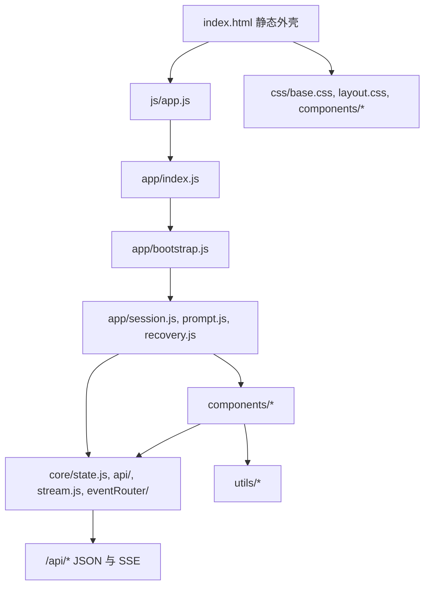
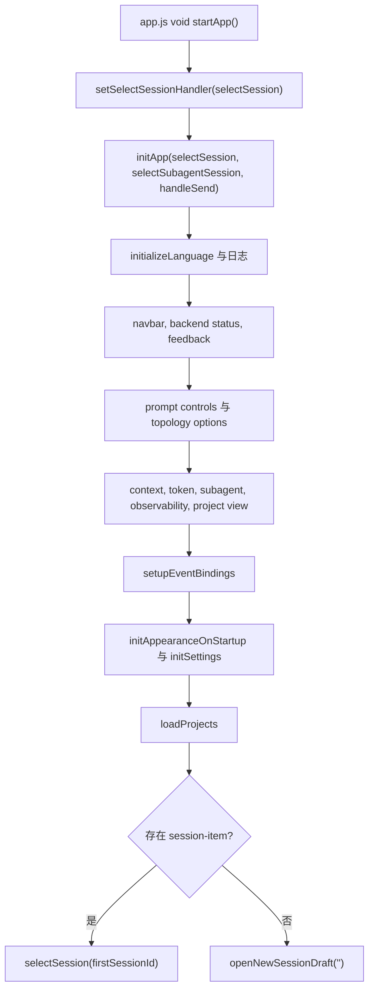

# 前端架构

## 总体分层

前端是一个静态托管的 ES Modules 单页应用，分成六层：

- HTML 外壳：`frontend/dist/index.html` 提供稳定 DOM 容器和入口脚本。
- 应用编排层：`frontend/dist/js/app/` 负责启动顺序、会话选择、prompt 提交、恢复和主视图同步。
- 核心运行层：`frontend/dist/js/core/` 负责 API facade、全局状态、SSE stream、事件路由和 foreground submission。
- 组件层：`frontend/dist/js/components/` 负责具体 UI 区域和功能面板。
- 工具层：`frontend/dist/js/utils/` 提供 DOM、i18n、日志、反馈、Markdown、通知等横切能力。
- 样式层：`frontend/dist/css/` 提供主题 token、页面布局和组件样式。

## 启动流程

入口文件是 `frontend/dist/js/app.js`，它只导出 `selectSession` 并调用 `startApp()`。`startApp()` 位于 `app/index.js`，负责把 sidebar 的会话选择 handler 绑定到 `app/session.js`，再调用 `initApp()`。

`app/bootstrap.js` 是启动中心，当前初始化顺序是：

1. 安装全局错误日志。
2. 初始化语言和系统日志。
3. 初始化 UI feedback、后端状态监测、导航栏绑定。
4. 初始化 prompt 相关控件：YOLO、thinking、session topology、mention autocomplete。
5. 初始化上下文、token usage、debug badge、subagent rail、observability、image preview、project view。
6. 绑定 prompt 输入、提交、停止 run、approval resolved 等事件。
7. 初始化外观和设置弹窗。
8. 加载项目/会话列表。
9. 如果侧边栏已有会话，自动选择第一个会话；否则打开新会话草稿页。

## 应用编排层

`js/app/` 不是页面组件集合，而是运行流程编排层：

- `bootstrap.js`：启动和全局事件绑定。
- `index.js`：应用启动 facade，连接 sidebar 和 session handler。
- `prompt.js`：prompt composer、附件、mention、slash command、role/topology 控件、发送流程。
- `session.js`：会话和 subagent 会话选择，处理切换、取消、加载历史、状态清理。
- `sessionView.js`：会话视图 hydration 的辅助逻辑。
- `recovery.js`：run 恢复快照、approval、user question、paused subagent、background task、resume/stop。
- `retryStatus.js`：重试状态展示辅助。

这一层的特点是会同时调用 `components` 和 `core`。例如 `session.js` 会清理消息面板、隐藏 project view、设置 rounds mode、请求 session history、更新 `state`，再触发 recovery 和 token usage 刷新。

## 核心运行层

`js/core/` 承担跨页面的运行能力：

- `state.js`：全局 UI 状态对象和 role/session helper。
- `api/`：按后端领域拆分的 API 模块，统一由 `core/api/index.js` 导出。
- `api/request.js`：共享请求 helper，提供错误处理、GET 合并缓存、并发 lane、AbortSignal 和后端状态 hint。
- `stream.js`：创建 run、连接前台 SSE、管理后台 run multiplex、subagent stream、停止 run、断线重连和 session switch detach。
- `eventRouter/`：把 SSE RunEventType 分发到 run、tool、human、notification 等 handler。
- `submission.js`：前台提交状态，避免 session 切换和 prompt 发送互相踩踏。

## 组件层

`js/components/` 以用户可见区域和功能域组织：

- `sidebar.js`、`sessionSidebarStore.js`、`sessionSearch.js`：左侧项目/会话列表、搜索、排序、会话状态。
- `newSessionDraft*.js`：新会话草稿页、快捷卡片、workspace 选择、mention 和 aside。
- `messageRenderer/`、`messageTimeline/`：历史消息和流式消息渲染、timeline store、copy action、scroll controller。
- `rounds/`：round timeline、navigator、paging、todo、retry、scroll。
- `projectView.js`：workspace 视图和 feature view 的主要实现，包含 Skills、Automation、Connectors 等入口。
- `settings/`：设置弹窗 shell 和各 tab panel。
- `subagentRail.js`、`subagentSessions.js`、`agentPanel/`：右侧 subagent rail、subagent session、agent drawer。
- `observability.js`：观测视图。
- `contextIndicators.js`、`sessionTokenUsage.js`、`sessionDebugBadge.js`：composer 附近的状态指示。
- `imagePreview.js`：图片预览 modal。

## 全局状态模型

`core/state.js` 暴露一个共享 `state` 对象。它不是后端数据模型，而是浏览器 UI 当前态，包括：

- 当前会话：`currentSessionId`、`currentWorkspaceId`、`currentSessionMode`。
- 当前视图：`currentMainView`、`currentProjectViewWorkspaceId`、`currentFeatureViewId`。
- run 状态：`isGenerating`、`activeEventSource`、`activeRunId`、`runPrimaryRoleMap`。
- subagent 状态：`activeSubagentSession`、`activeView`、`activeAgentRoleId`、`activeAgentInstanceId`、`pausedSubagent`。
- role/topology：coordinator、main agent、normal roles、selected role、orchestration preset。
- run 事件索引：instance、role、task 映射和 task status。
- 恢复状态：`currentRecoverySnapshot`。
- prompt 选项：YOLO 和 thinking。
- 布局偏好：`rightRailExpanded`。

状态更新规则：

- 后端真相通过 API 拉取后写入 `state`。
- 跨组件 UI 同步可以通过 `state` helper 或 DOM `CustomEvent`。
- 组件不应绕过 `core/api` 直接拼散落的请求逻辑。
