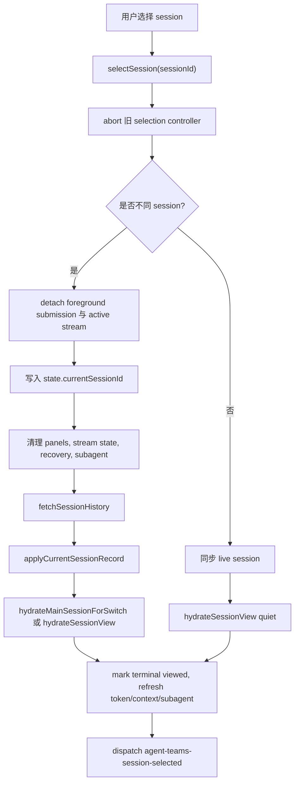
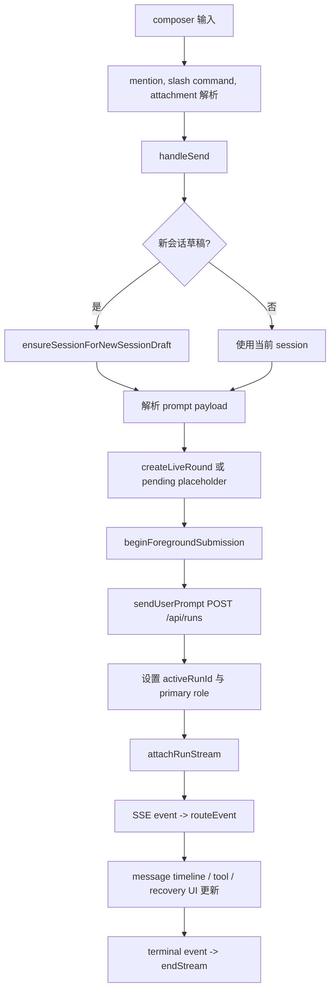
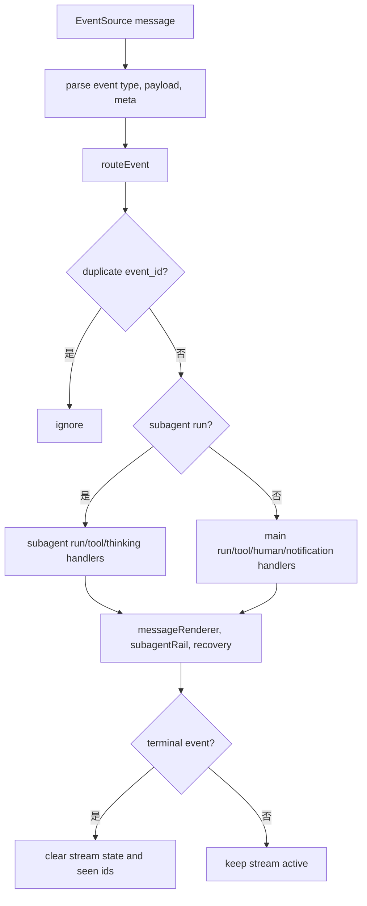

# 运行流程设计

## 会话选择流程

负责模块：

- `app/session.js`
- `app/sessionView.js`
- `app/recovery.js`
- `core/stream.js`
- `components/sidebar.js`
- `components/messageRenderer.js`
- `components/subagentSessions.js`
- `components/subagentRail.js`

流程说明：

1. 用户点击 sidebar session 或触发 `agent-teams-select-session`。
2. `selectSession(sessionId)` 标准化 id，并创建新的 selection token 和 AbortController。
3. 如果正在选择旧 session，旧 controller 被 abort，旧 loading 状态被清理。
4. 如果切换到不同 session，前台 submission 和 active stream 会 detach，可能转入后台 stream。
5. 更新 `state.currentSessionId`，清理 active subagent、agent panels、context indicators、token usage、stream overlay、recovery snapshot。
6. UI 进入 session switch pending/loading 状态。
7. 调用 `fetchSessionHistory(sessionId)`。
8. 应用 session record 中的 mode、normal root role、orchestration preset、can switch mode。
9. 调用 `hydrateMainSessionForSwitch()` 或 `hydrateSessionView()` 渲染历史和 round。
10. 根据 terminal run 状态调用 `markSessionTerminalRunViewed()`。
11. 刷新 coordinator context、session token usage、subagent session list。
12. 派发 `agent-teams-session-selected`。

并发与取消：

- `sessionSelectionToken` 保证旧请求返回后不会覆盖新选择。
- `AbortController` 传入 API 请求，切换时主动取消。
- session switch loading 有短延迟，快速切换不会闪烁。

## Subagent 会话选择流程

负责模块：

- `app/session.js`
- `components/subagentSessions.js`
- `components/subagentRail.js`

流程说明：

1. 用户选择 subagent session 或触发 `agent-teams-select-subagent-session`。
2. 如果 parent session 正在加载，取消 parent selection，但保留目标 session id。
3. 如果当前不是 parent session，先 `selectSession(parentSessionId)`。
4. 从缓存 subagent records 中解析目标 instance，找不到时使用 fallback。
5. 隐藏 project view，切回 rounds mode。
6. 调用 `openSubagentSession()`。
7. 后台刷新 subagent session list。
8. 派发 `agent-teams-subagent-session-selected`。

## Prompt 提交流程

负责模块：

- `app/prompt.js`
- `components/newSessionDraft.js`
- `components/rounds/timeline.js`
- `core/submission.js`
- `core/stream.js`

流程说明：

1. 用户在 composer 输入文本、附件、mention 或 slash command。
2. `handlePromptComposerInput()` 同步输入状态、mention 菜单和 token chip。
3. Enter 或表单 submit 调用 `handleSend()`。
4. 如果当前是新会话草稿，先 `ensureSessionForNewSessionDraft()` 创建 session 并应用 topology。
5. 根据 composer 解析 prompt text、input parts、display input parts、skills、target role、YOLO、thinking。
6. 创建 live round 或 pending run placeholder。
7. `beginForegroundSubmission()` 标记前台提交。
8. `startIntentStream()` 调用 `sendUserPrompt()`，即 POST `/api/runs`。
9. 后端返回 run 后，更新 `state.activeRunId` 和 run primary role。
10. 连接前台 SSE，stream event 进入 `routeEvent()`。
11. run terminal 后结束 stream，释放 composer busy 状态并刷新 session/recovery。

关键状态：

- `state.isGenerating` 控制 composer 是否 busy。
- `pendingRunStart` 用于处理 run 创建过程中 session 切换。
- `pendingStopRequest` 支持 run 创建尚未完成时立即 stop。
- `state.thinking` 和 `state.yolo` 来自 composer 控件和 localStorage。

## 语音输入流程

负责模块：

- `components/voiceInput.js`
- `components/voiceInputWorklet.js`
- `components/settings/speechSettings.js`
- `app/prompt.js`

流程说明：

1. Speech settings 选择一个支持 STT 的 model profile，并保存语言和提示词。
2. composer 的 `#voice-input-btn` 根据 speech config 和浏览器能力显示或启用；未配置 STT profile 时按钮隐藏。
3. 点击麦克风或长按空格启动语音输入；长按空格会聚焦 `#prompt-input`，且按住期间不触发静音自动停止。
4. 前端通过 `getUserMedia()` 获取麦克风音频，优先使用 AudioWorklet，降级到 ScriptProcessor。
5. 音频统一重采样为 16k PCM，通过 STT WebSocket 发送到后端。
6. 后端返回 partial/final transcript 后，前端实时写入 prompt。
7. 检测到长时间无语音、用户松开空格、点击停止、发送 prompt 或 backpressure 持续超限时，前端停止采集并等待最终转写。
8. `app/prompt.js` 在发送前会等待语音输入停止并保留已转写文本，避免尾部语音丢失。

交互约束：

- 语音按钮、stop/resume 和 send 都在 `.composer-actions` 中排布；已配置 STT 时，运行中插入消息仍可使用语音输入向 prompt 写入。未配置 STT 时，长按空格不拦截普通文本输入。
- 语音输入错误使用 dedupe toast，避免一次失败弹出重复错误。
- TTS 朗读不走后端模型，消息朗读复用浏览器原生 `speechSynthesis`。

## SSE 流程

负责模块：

- `core/stream.js`
- `core/eventRouter/index.js`
- `core/eventRouter/runEvents.js`
- `core/eventRouter/toolEvents.js`
- `core/eventRouter/humanEvents.js`
- `core/eventRouter/notificationEvents.js`
- `components/messageRenderer/stream.js`
- `app/recovery.js`

连接类型：

- 前台 run stream：当前会话正在运行的主要 EventSource。
- 后台 run multiplex：用户切走 session 后仍需要跟踪的 run。
- normal mode subagent stream：normal mode 下 subagent/background task 的流。

流程说明：

1. run 创建成功后 `attachRunStream()` 打开 EventSource。
2. 收到 SSE 后解析 event type、payload、event meta。
3. `routeEvent(evType, payload, eventMeta)` 去重 event id。
4. 根据 run id 判断是否 subagent run。
5. 更新 task instance/status、role instance 映射。
6. 分发到 run/tool/human/notification/background task handler。
7. handler 更新 message stream、thinking block、tool block、approval controls、round todo、token usage、recovery snapshot。
8. terminal event 清理 seen event ids、stream state、busy 状态。

断线与后台策略：

- 前台切换 session 时，active stream 会 detach 为 background stream，避免 run 失联。
- multiplex 连接维护多个后台 run，并有最大 stream 数预算。
- reconnect delay 有上限，避免频繁重连。
- 对 session/run not found 有 cooldown，避免重复请求打爆后端。

## Event Router 分发

主 run event：

- `run_started`、`run_resumed`：标记 run 开始，同步 round todo。
- `model_step_started` / `model_step_finished`：同步 agent/role/task 状态。
- `text_delta` / `output_delta`：追加流式内容。
- `thinking_started` / `thinking_delta` / `thinking_finished`：渲染 thinking block。
- `generation_progress`：渲染生成进度。
- `run_completed` / `run_failed` / `run_stopped`：终止 run，刷新 round 和 recovery。
- `token_usage`：刷新 session token usage。
- `todo_updated`：更新 round todo。

tool event：

- `tool_call`：追加 tool call block。
- `tool_input_validation_failed`：标记输入校验失败。
- `tool_result`：更新 tool result。
- `tool_approval_requested`：挂载 approval controls。
- `tool_approval_resolved`：标记 approval 结果，并触发恢复。

human event：

- `subagent_gate`
- `subagent_stopped`
- `subagent_resumed`
- `gate_resolved`
- user question requested/answered 主要通过 recovery snapshot 呈现。

background task event：

- `background_task_started`
- `background_task_updated`
- `background_task_completed`
- `background_task_stopped`

这些事件会刷新 recovery continuity，并在 payload 可展示时更新后台任务 UI 和 subagent session 记忆。

## Recovery 流程

负责模块：

- `app/recovery.js`
- `components/rounds/timeline.js`
- `components/subagentRail.js`
- `core/api/runs.js`
- `core/api/sessions.js`

恢复快照内容：

- active run。
- pending tool approvals。
- pending user questions。
- active background tasks。
- paused subagent。
- terminal run 状态。

流程说明：

1. session hydration 或 run event 后调用 `scheduleRecoveryContinuityRefresh()`。
2. `refreshSessionRecovery()` 请求 `fetchSessionRecovery()`。
3. `applyRecoverySnapshot()` 标准化快照，写入 `state.currentRecoverySnapshot`。
4. 渲染 recovery banner、approval host、question host，并 overlay 到 round。
5. 如果需要自动恢复，调用 `resumeRecoverableRun()`。
6. 用户处理 approval 或 question 后，调用对应 API，再派发或监听恢复事件。
7. terminal 状态或没有待处理项时清理 recovery snapshot。

approval 表现：

- pending approval 在 composer 上方或 message/tool block 中显示。
- 用户可 approve/reject，并可提供 feedback。
- action busy 时禁用对应按钮。
- 失败时保留 pending 项并显示错误。

user question 表现：

- 展示一个或多个问题。
- 支持选项或自由补充。
- 支持 none-of-the-above 风格选项。
- 提交后刷新 recovery。

paused subagent 表现：

- 显示暂停的 subagent、role、run 信息。
- 用户可进入 subagent session 或恢复主 run。

background task 表现：

- 后台任务出现在 recovery/banner 或 session 相关状态中。
- task 更新会延迟刷新 recovery，避免事件密集时过度请求。

